# LAMP STACK IMPLEMENTATION (Linux, Apache, MySQL, PHP or Python) ON AWS

## About The Project

This project covers essential topics suchs as setting up a Linux environment, configuring the Apache webserver, managing MySQL databases, and writing PHP code for server-side functionality. The project will equip one with the expertise to leverage the power of the LAMP stack and build robust, scalable, and secure web applications.

## Prerequisites

- AWS account setup and Provisioning an Ubuntu Server 

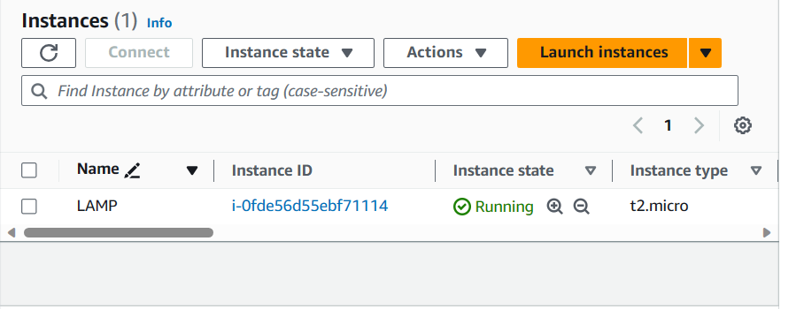

- Connecting to an EC2 Instance

`ssh -i <private-key-name>.pem ubuntu@<Public-IP-address>`

- Linux server successful setup

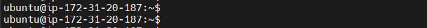

Connection architecture diagram:
  
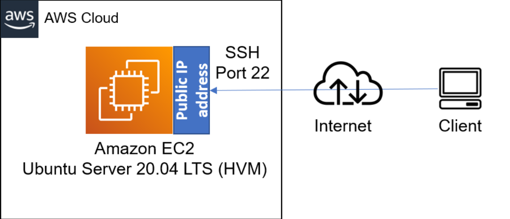

Successful login into ec2 instance
## STEP 1 - INSTALLING APACHE WEB SERVER

Install Apache via Ubuntu Package Manager 
`apt`

Update a list of packages in package manager
`sudo apt update`

Run apache2 package installation  
`sudo apt install apache2`

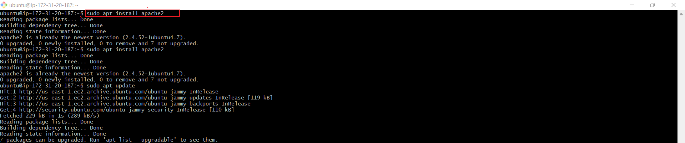

To verify that Apache2 is running as a service in the OS

`sudo systemctl status apache2`

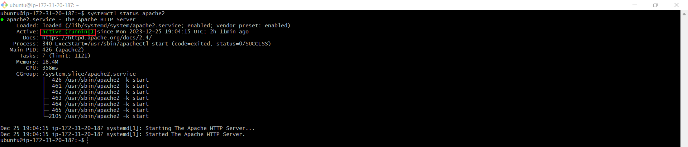

The text that shows "Active" indicates that Apache webserver is live.

## Configuring Security Group Inbound Rules on EC2 Instance

A Security Group functions as a collection of rules resembling a virtual firewall, managing the flow of incoming (inbound) and outgoing (outbound) traffic for an instance.

Upon instance creation, a default TCP rule is activated on port 22, facilitating SSH connections to a terminal. To guarantee accessibility of our webpages from the internet, it's essential to establish an inbound TCP rule for port 80.

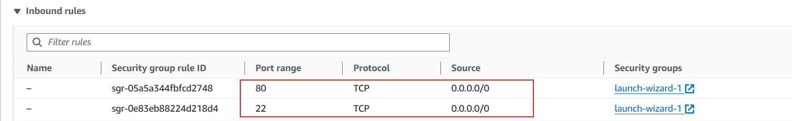

To check assessibility of web server on the Ubuntu shell:

`curl http://localhost:80`or `curl http://127.0.0.1:80`

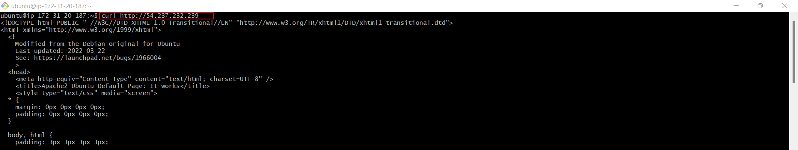

To check if Apache HTTP server can respond to request from the internet,open a web browser and try to access following url

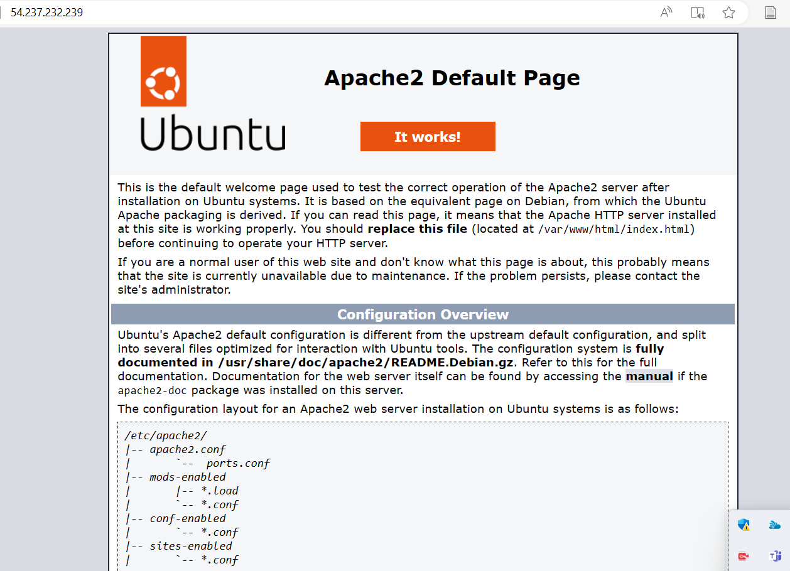

## STEP 3 - INSTALLING MYSQL

With the Apache web server operational, the next step involves installing a Database Management System (DBMS) to store and manage data for the site. MySQL, a relational database management system commonly utilized within PHP environments, will be employed for this particular project

Again, use `apt` to acquire and install this software:

`sudo apt install mysql-server -y`

Log into the MySQL console by typing

`sudo mysql`

This will connect to the MySQL server as the administrative database root user, which is inferred by the use of `sudo` when running this command 

Define the users password using this command 
`ALTER USER 'root'@'localhost' IDENTIFIED WITH mysql_native_password BY 'password';`

Exit the MySQL shell with the command:

`mysql> exit`

Start the interactive script by running:

`sudo mysql_secure_installation`

This will ask if you want to configure the `VALIDATE PASSWORD PLUGIN`

Note: If enabled, passwords which don't match the specified criteria will be rejected by MySQL with an error. it is safe to leave validation disabled, but you should always use strong, unique passwords for database credentials.

Answer `Y` for yes, or anything else to continue without enabling.

The MySQL server is now install

`VALIDATE PASSWORD PLUGIN can be used to test passwords`
`and improve security. It checks the strength of password`
`and allows the users to set only those passwords which are`
`secure enough. Would you like to setup VALIDATE PASSWORD plugin?`

`Press y|Y for Yes, any other key for No:`

if the answer is "yes", you'll be asked to select a level of password validation.

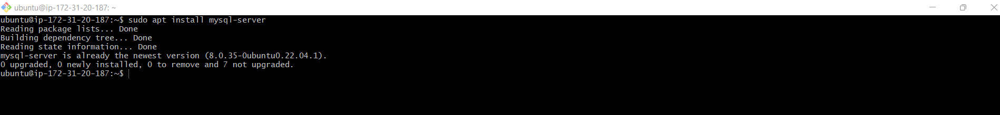

## STEP 4-INSTALLING PHP

Apache has been installed to serve content and MySQL installed to store and manage your data. PHP is the component of our setup that will process code to display dynamic content to the end user. 

In addition to the `php` package, you'll need `php-mysql`, a PHP module that allows PHP to communicate with MySQL-based databases. You'll need `libapache2-mod-php` to enable Apache to handle PHP files. Core PHP packages will automatically be installed as dependencies. 

To install these 3 packages at once, run: 

`sudo apt install php libapache2-mod-php php-mysql`

Once the installation is finished you can run the following command to confirm your PHP version:

`php -v`

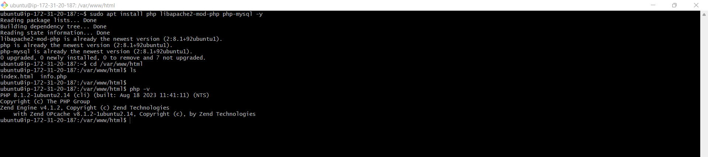

At this point, LAMP stack is completely installed and fully operational.

## STEP 5-ENABLE PHP ON THE WEBSITE

With the default DirectoryIndex settings on Apache, a file named `index.html` will always take precedence over an `index.php` file. This is useful for setting up maintenance pages in PHP applications, by creating a temporary `index.html` file containing an informative messag to visitors. Because this page will take precedence over the `index.php` page, it will then become the landing page for the application. Once maintenance is over, the `index.html` is renamed or removed from the document root , bringing it back to the regular application page.

in case you want to change this behaviour, you'll need to edit the `/etc/apache2/mods-enabled/dir.conf`

After saving and closing the file, you will need to reload Apache so the changes take effect:

`sudo systemctl reload apache2`

Finally create a PHP script to test that PHP is correctly installed and configured on the server.
Create a new file named `index.php` inside your custom web root folder:

`vim /var/www/projectlamp/index.php`

This will open a blank file. Add the following text, which is valid PHP code, inside the file:

"<?php
phpinfo();"

When finished save and close the file, refresh the page and you will see a page similar to this: 

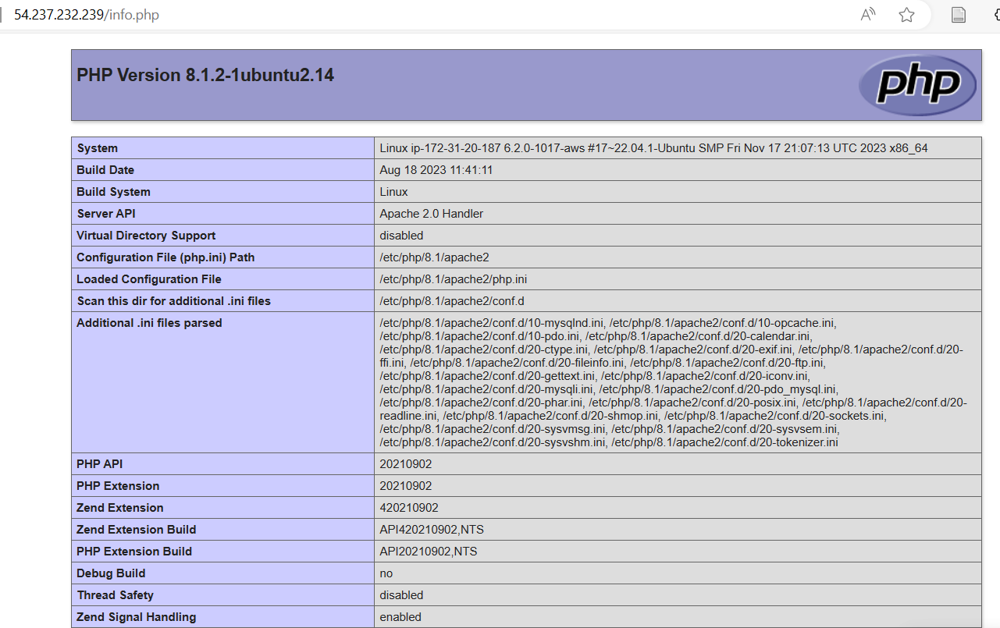

### Acknowledgement:
* [Digital Ocean](https://marketplace.digitalocean.com/apps/lamp)

## STEP-5 CREATING A VIRTUAL HOST FOR YOUR WEBSITE USING APACHE

This begins by setting up a domain called `projectlamp`.

By default, on Ubuntu 20.04, Apache has a single server block enabled, set up to serve content from the /var/www/html directory. We'll be adding our own directory alongside the default one.

Create the directory for `projectlamp` using 'mkdir' command as follows:

`sudo mkdir /var/www/projectlamp`

Next assign ownership of the directory with the `$USER` environment variable, which will reference your current system user: 

`sudo chown -R $USER:$USER /var/www/projectlamp`

Then,create and open a new configuration file in Apache's `sites-available` directory using your preferred command-line editor. Here, we'll be using `vi` or `vim`

`sudo vi /etc/apache2/sites-available/projectlamp.conf`

This will create a new blank fil. Paste in the following bare-bones configuration by hitting on `i` on the keyboard to enter the insert mode, and paste the text: 

<VirtualHost *:80>
    ServerName projectlamp
    ServerAlias www.projectlamp 
    ServerAdmin webmaster@localhost
    DocumentRoot /var/www/projectlamp
    ErrorLog ${APACHE_LOG_DIR}/error.log
    CustomLog ${APACHE_LOG_DIR}/access.log combined
</VirtualHost>

To save and close the file, simply follow the steps below:

1. Hit the `esc` button on the keyboard
2. Type `:`
3. Type `wq`. w for `write` and q for `quit`
4. Hit `ENTER` to save the file

You can use the `ls` command to show the new file in the sites-available directory

`sudo ls /etc/apache2/sites-available`
`You will see something like this`
`000-default.conf  default-ssl.conf  projectlamp.conf`

With this virtualHost configuration, we're telling Apache to serve `projectlamp` using **/var/www/projectlamp** as its web root directory. if you would like to test Apache without domain name, you can rem3ove or comment out the options Servername and ServerAlias by adding a # character in the beginning of each option lines. Adding the # character there will tell the program to skip processing the instructions on those lines.

you can now use ***a2ensite*** command to enable the new virtual host

`sudo a2ensite projectlamp`

you might want to disable the default website that comes installed with Apache. This is required if you're not using a custom domain name, because in this case Apache's default configuration would overwrite your virtual host. To disable Apache's default website use ***a2dissite*** command, type:

`sudo a2dissite 000-default`

To ensure the configuration file doesn't contain syntax errors, run:

`sudo apache2ctl configtest`

Finally reload Apache so these changes take effect:

`sudo systemctl reload apache2`

Your new website is now active, but the web root **/var/www/projectlamp** is still empty. Create an index.html file in that location so that we can test that the virtual host works as expected:

`sudo echo 'Hello LAMP from hostname' $(curl -s http://169.254.169.254/latest/meta-data/public-hostname) 'with public IP' $(curl -s http://169.254.169.254/latest/meta-data/public-ipv4) > /var/www/projectlamp/index.html`

Now go to your browser and try to open your website URL using IP address:

`http://<Public-IP-Address>:80`

if you see the text from **'echo'** command you wrote to index.html file, then it means your Apache virtual host is working as expected. In the output you will see your server's public hostname (DNS name) and public IP address. You can also access your website in your browser by public DNS name, not only by IP-try it out, the result must be the same (port is optional)

`http://<Public-DNS-Name>:80`

You can leave this file in place as a temporary landing page for your application until you set up an `index.php` file to replace it. Once you do that, remeber to remove or rename the `index.html` file from your document root, as it would take precedence over an `index.php` file by default.

