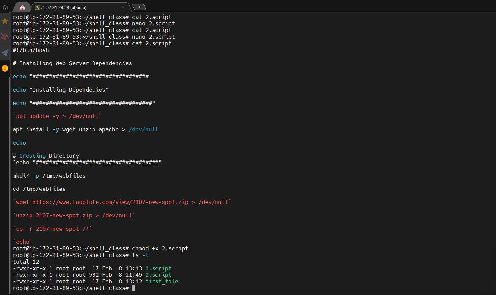

# SHELL SCRIPTING 

Shell scritpting helps automate repetitive task. Bash scripts are essentially a series of commands and instructions that are executed sequentially in a shell. You can create a shell script by saving collection of commands in a text file with a .sh extension. These scripts can be executed directly from the command line or called from other scripts. 

## Shell Scripting Syntax Elements 

### 1. Variables 
Bash allows you to define and work with variables. Variables can store data of various types such as numbers, strings, and arrays. You can assign values to variables using the = operator, and access their values using the variable name preceded by a $ sign. 

### Assigning value to a variable 

`name="John"` 

### Retrieving value from a variable 

`echo $name`

### 2. Control Flow

Bash provides control flow statements like if-else, for loops, while loops, and case statements to control the flow of execution in your scripts. These statements allow you to make decisions, iterate over list, and execute different commands based on conditions.

Uisng if-else to execute script based on a conditions

`#!/bin/bash`
`Example script to check if a number is positive, negative, or zero`

`read -p "Enter a number" num`

`if [ $num -gt 0]; then`
    `echo "The number is positive"`
`elif [$num -1t 0 ]; then`
    `echo "The number is negative"`
`else`
    `echo "The number is zero"`
`fi`

The piece of code prompts you to type a number and prints a statement stating the number is positive or negative. 

### Iterating through a list using a for loop

`#!/bin/bash`
### Example script to print numbers from 1 to 5 using a for loop¬

`for (( i=1; i<=5; i++ ))`
`do`
    `echo $i`

`done`

## Command Substitution
Using backtick for command substitution

`current_date = date +%Y-%m-%d`
Using `$()` syntax for command substitution

### Input and Output 
Bash provides various ways to handle input and output. You can use the read command to accept user input and ,output using operators like > (output to a file), < (input from a file), and | (pipe the output of one command as input to another)

`echo "Enter your name:"`
`read name`

### Output text to the terminal 

`echo "Hello World"`

To out the result of a command into a file:
`echo "hello world" > index.txt`

To pass the result of a command as input to another command 

`echo "hello world" | grep "pattern"`

## Functions
Bash allows you to define and use functions to group related commands together. Functions provide a way to modularize your code and make it more reusable.

## Write a shell script
Step 1: Open a folder called shell scripting using `mkdir shell-scripting`. This would hold all the script we will write

Step 2: Create a file called "user-input.sh" using the command `touch user-input.sh`

Step 3: Paste the block of code inside 

Step 4: Save file

Step 5: Run the command `sudo chmod +x user-input.sh` this makes the file executable

Step 6: Run the script using the command `./user-input.sh`

## Directory Manipulation and Navigation

Step 1: open a file named *navigating-linux-filesystem.sh*

Step 2: paste the code block into the file

Step 3: Run the command `sudo chmod +x navigating-linus-filesystem.sh` to set execute permission on the file.

Step 4: Run your script using this command  `./navigating-linux-filesystem.sh`

## File Operations and Sorting 

This script creates three files (file1.txt, file2.txt, and file3.txt),displays the files in their current order, sorts them alphabetically, saves the sorted files in sorted_files.txt, displays the contents of the final sorted file.

Step 1. Open your terminal and create a file called sorting .sh using the command `touch sorting.sh`

Step 2. Copy and paste the code block below into the file

Step 3: Set execute permission on sorting.sh using this command:
`sudo chmod +x sorting.sh`

Step 4: Run your script using the command `./sorting.sh`

## Working with Numbers and Calculations

This script define two variables num1 and num2 with numeric values, performs basic arithmetic operations (addition, subtraction, multiplication, division, and modulus), and displays the results. It also performs more complex calculations such as raising num1 to the power of 2 and calculating the square root of num2, and displays those results as well.

step 1: On the terminal create a file called calculations.sh using the command 
`touch calculations.sh`

step 2: Copy and paste the code block below:

step 3: Set execute permission on calculations.sh using the command `sudo chmod +x calculations.sh`

step 4: Run your script using this command `./calculations.sh`

## File Backup and Timestamping 

This script defines the source directory and backup directory paths. It then creates a timestamp using the current date and time, and creates a backup directory using the cp command with the -r option for recursive copying. Finally, it displays a message indicating the completion of the backup process and shows the path of the backup directory with the timestamp.

Step 1: On the terminal open a file backup.sh using the commnd `touch backup.sh`

Step 2: Copy and paste the code block 

`#!/bin/bash`

# Define the source directory and backup directory
`source_dir="/path/to/source_directory"`
`backup_dir="/path/to/backup_directory"`

# Create a timestamp with the current date and time
`timestamp=$(date +"%Y%m%d%H%M%S")`

# Create a backup directory with the timestamp
`backup_dir_with_timestamp="$backup_dir/backup_$timestamp"`

# Create the backup directory
`mkdir -p "$backup_dir_with_timestamp"`

# Copy all files from the source directory to the backup directory
`cp -r "$source_dir"/* "$backup_dir_with_timestamp"`

# Display a message indicating the backup process is complete
`echo "Backup completed. Files copied to: $backup_dir_with_timestamp"`

step 3: Set execute permission on backup.sh using this command:
`sudo chmod +x backup.sh`

step 4: Run your script using the command: `./backup.sh`

# WEB SETUP USING SHELL SCRIPT

#!/bin/bash

# Installing Web Server Dependencies
echo "###################################"
echo "Installing Dependecies"
echo "####################################"
apt update -y > /dev/null
apt install -y wget unzip apache2 > /dev/null
echo

# Creating Directory
echo "#####################################"
echo "Create Directory"
echo "#####################################"
mkdir -p /tmp/webfiles 
cd /tmp/webfiles
wget https://www.tooplate.com/zip-templates/2107_new_spot.zip > /dev/null
unzip 2107_new_spot.zip > /dev/null
cp -r 2107_new_spot/* /var/www/html/          
echo

### Checking for free disk space 
#!/bin/bash

echo "Welcome $USER on $HOSTNAME."
echo "############################"

FREERAM=$(FREE - m | grep Mem | awk {print $4})
ROOTFREE=$(df -h | grep 'dev/root' | awk '{print $4})

echo "###########################"
echo "available free RAM is $FREERAM MB"
echo "############################"
echo "The Current load is $LOAD)"
echo "############################"
echo "The Available ROOT partition is $ROOTFREE"

# Remote Execution - Shell Scripting 

echo "welcome $USER on $HOSTNAME" 
echo "###########################"

FREERAM$(free -m | grep Mem | awk '{print $4}')
LOAD= `uptime`
ROOTFREE 

