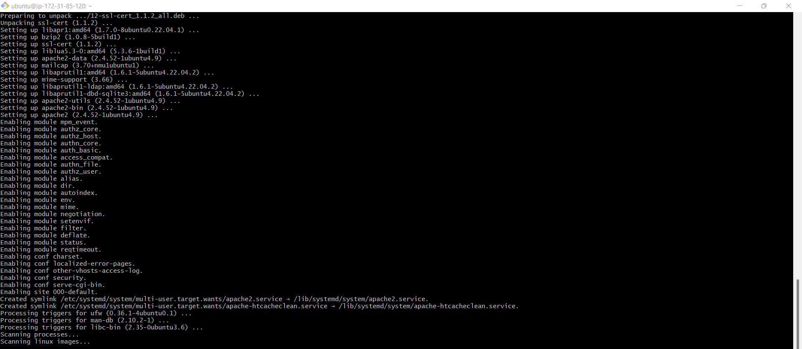
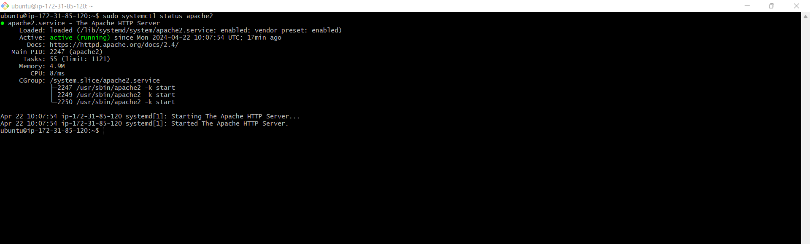
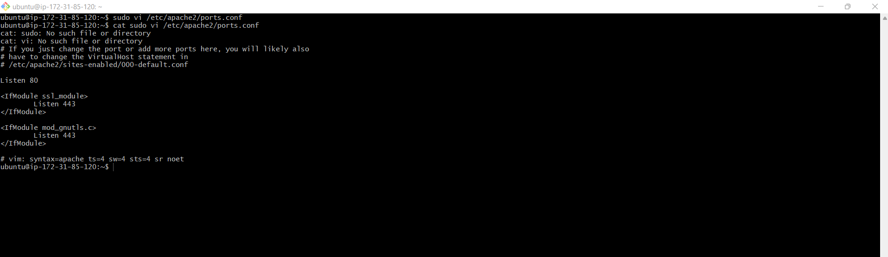
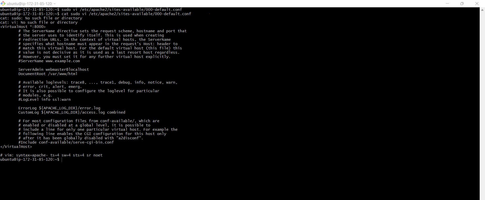
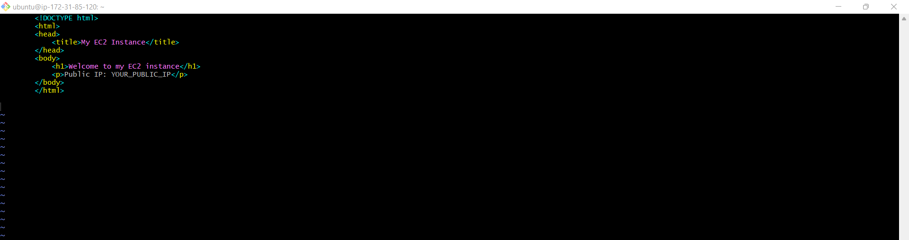
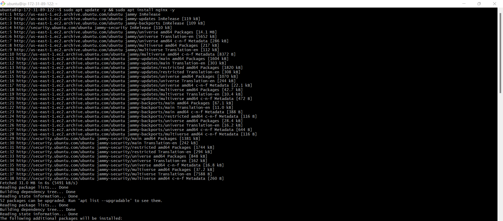
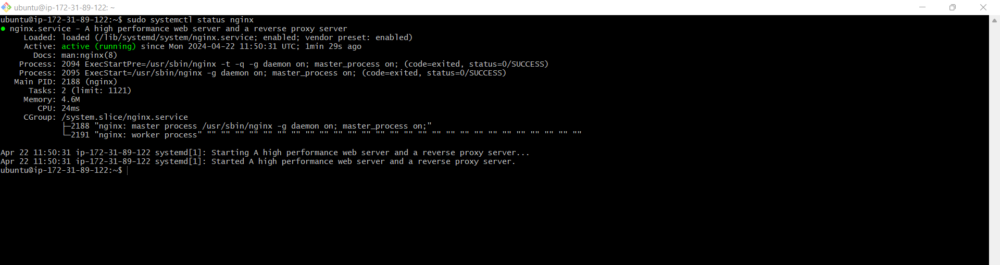
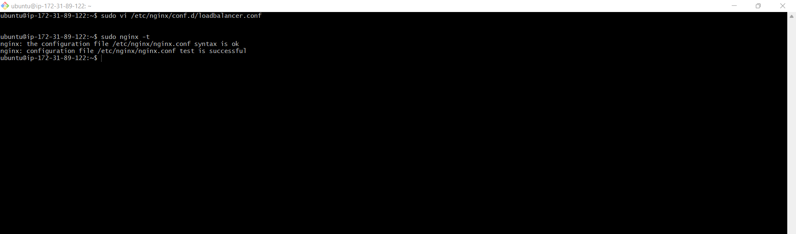

# IMPEMENTING LOADBALANCERS WITH NGINX
Load balancing means distributing the work or task among several computers or servers so that no one computer gets overloaded with too much work. This helps to keep everything running smoothly and ensures that websites and apps work quickly and don't get too slow. For example, a set of webservers serving a website. In other to distribute the traffic evenly between the webservers, a load balancer is deployed. The load balancer is deployed in front of the webservers and all traffic gets to it first, it then distributes the traffic across the set of webservers. 

Nginx is a versatile software that can act like a webserver, reverse proxy, and a load balancer etc. All that is required is to configure it properly. 

# Setting Up a Basic Load Balancer

We are going to be provisioning two EC2 instances running ubuntu 22.04 and install apache webserver in them. We will open port 8000 to allow traffic from anywhere and finally update the default page of the webservers to display their publicIP address.

Next we will provision another EC" instance running ubuntu 22.04 and this time install Nginx and configure it to act as a load balancer distributing traffic across the webservers.

### Step 1: Provisioning EC2 instances

   Open AWS Management Console, click EC2. Scroll down the page and click on Launch instance:

Console

    Under Name, provide a unique name for each of your webservers:

### step 2: Open Port 8000

This is where our server will be running while load balancers runs on port 80. we need to open port 8000 to allow traffic from anywhere. To do this we need to add a rule to the security group of each of our webserver. 

### step 3: Install Apache Webserver

After provisioning both of our servers and have opened the necessary ports, its time to install apache software on both servers. To do so we must first connect to each of the webservers, click on your instance id, at the top of the page click on connect. 

Next install apache with the command below:

verify that Apache is working:

### step 4: Configure Apache to server a page showing its public IP

We will start by configuring Apache webserver to serve content on port 8000 instead of its default which is port 90. Then we will creaste a new ondex.html file. The file will contain code to display the public IP of the EC2 instance. we will then overide apache webserver's default html file with our new file.

Configuring Apache to server content on port 8000:

1. Uisng your text editor (e.g vi, nano) open the gile /etc/apache2/ports.conf

`sudo vi/etc/apache2/ports.conf`

2. Add a new listen directive for port 800. First type i to switch the editor to insert mode. Then add the listen directive. then save file. 

step 3: Next open the file /etc/apache2/sites-available/000-default conf and change port 80 on the virtualhost to 8000 like the screen shot below:

close the file above by pressing esc key on your keyboard then the command `wqa!`

Restart apache to load the new configurationusing the command:

`sudo systemctl restart apache2`

Creating our new html file:

1. Open a new index.html file with the command : `sudo vi index.html`

2. Switch vi editor to insert mode and paste the html file below. Before pasting the html file, get public IP of your EC2 instance from AWS Management Console and replace the placeholder text for IP address in the html file 

3. Change file pwnership of the index html file with the command belwo:

`sudo chown www-data:www-data ./index html` 

Overidding the Default html file with our new html file usiwng the command below:

`sudo systemctl restart apache2`

### step 5: Configuring Nginx as a Load Balancer

Provision a new EC2 instance running on ubuntu 22.04. Make sure port 80 is opened to accept traffic from anywhere. 

Next SSH into the instance. Again refer to step 3 for a refresher if needed.

Install Nginx into the instance usiwng the command belwo:

`sudo apt update -y && sudo apt install nginx -y`

Verify that Nginx is installed with the command below:

`sudo systemctl status nginx`

Open Nginx configuration file with the command below:

`sudo vi /etc/nginx/conf.d/loadbalancing.conf`

Paste the configuration file below to configure file is shown below: Make sure you edit the file and provide necessary information like your server IP address etc 

upstream backend_servers defines a group of backend servers. The server lines inside the upstream block list the addresses and ports of your backend servers. proxy_pass inside the location block sets upo the load balancing passing the requess to the backend servers. The proxy_set_header lines pass necessary headers to the backend servers to correctly handle the requests.

test your configuration with the command below:
`sudo nginx -t`

if there are no errors, restart Nginx to load the new configuration with the command below:

`sudo systemctl restart nginx`

Paste the public IP addresss of Nginx load balancer, you should see the same webpages served by the webservers.

