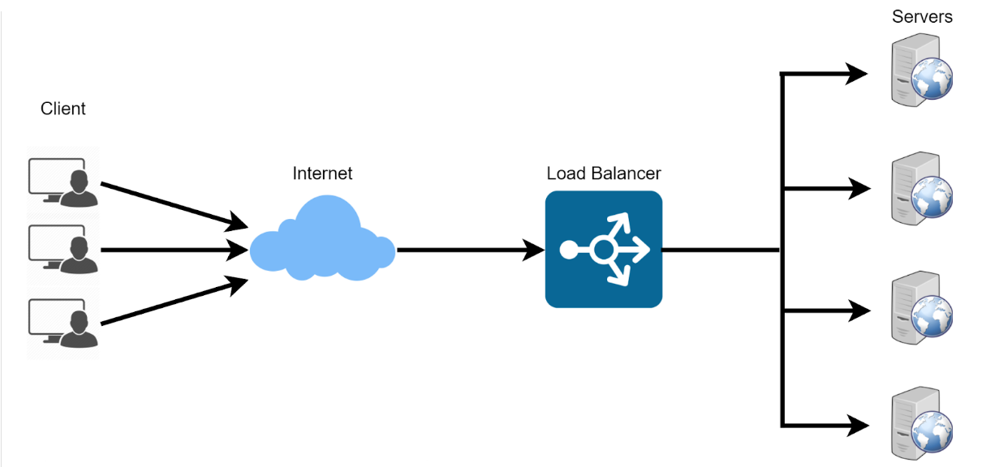

# IMPEMENTING LOADBALANCERS WITH NGINX
Load balancing means distributing the work or task among several computers or servers so that no one computer gets overloaded with too much work. This helps to keep everything running smoothly and ensures that websites and apps work quickly and don't get too slow. For example, a set of webservers serving a website. In other to distribute the traffic evenly between the webservers, a load balancer is deployed. The load balancer is deployed in front of the webservers and all traffic gets to it first, it then distributes the traffic across the set of webservers. 

Nginx is a versatile software that can act like a webserver, reverse proxy, and a load balancer etc. All that is required is to configure it properly. 

# Setting Up a Basic Load Balancer

We are going to be provisioning two EC2 instances running ubuntu 22.04 and install apache webserver in them. We will open port 8000 to allow traffic from anywhere and finally update the default page of the webservers to display their publicIP address.

Next we will provision another EC" instance running ubuntu 22.04 and this time install Nginx and configure it to act as a load balancer distributing traffic across the webservers.

### Step 1: Provisioning EC2 instances

   Open AWS Management Console, click EC2. Scroll down the page and click on Launch instance:

Console

    Under Name, provide a unique name for each of your webservers:

    