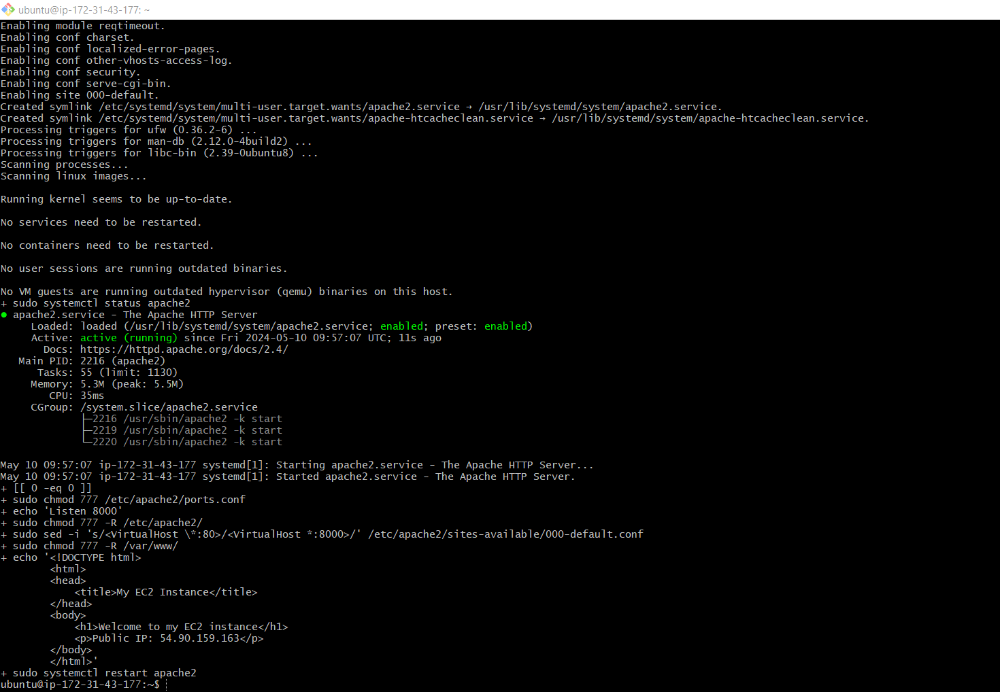
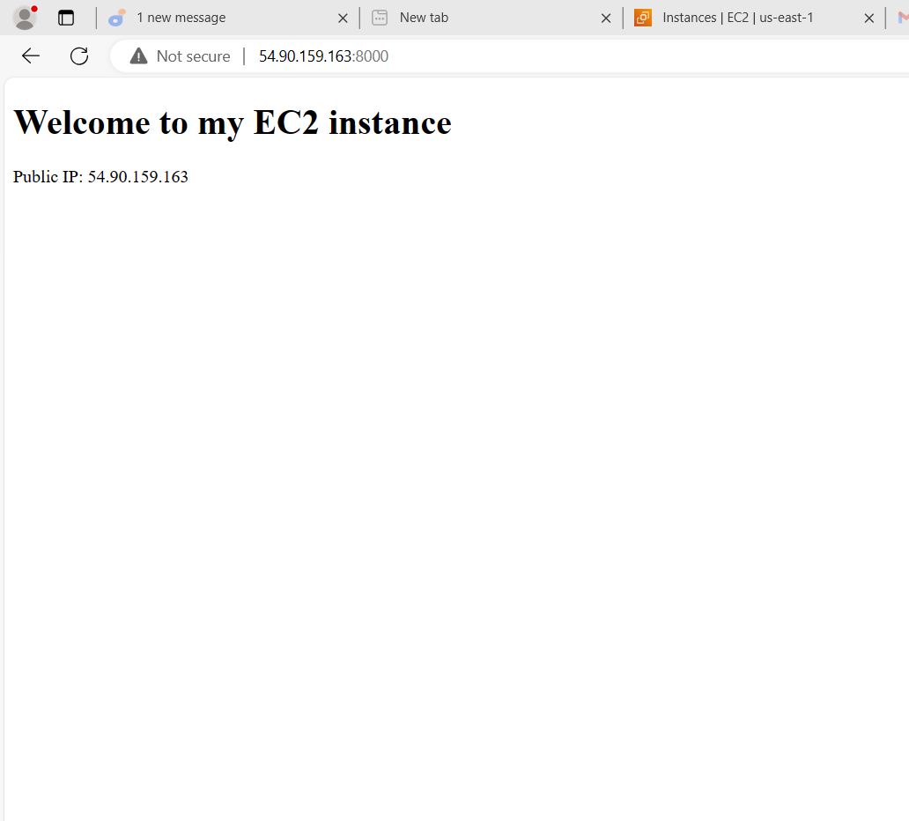
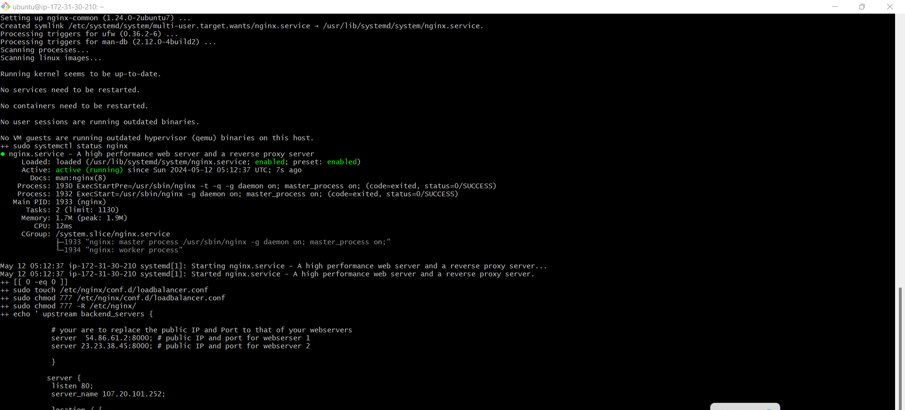
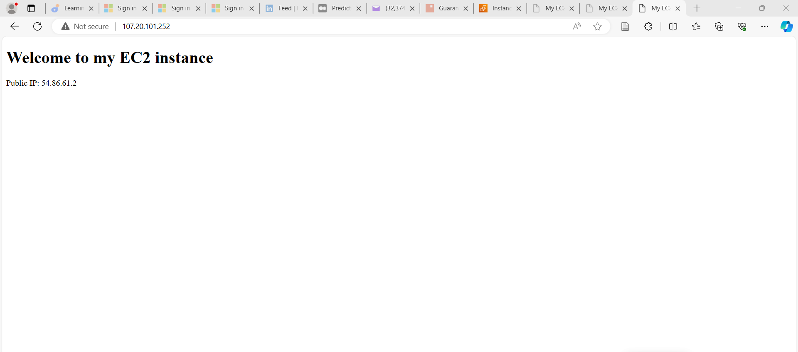

# Automate Deployment of Webservers

## Deploying and Configuring of Webservers

All the process we need to deploy our webservers has been codified in the shell script below: 

`#!/bin/bash`

`####################################################################################################################`
`##### This automates the installation and configuring of apache webserver to listen on port 8000`
`##### Usage: Call the script and pass in the Public_IP of your EC2 instance as the first argument as shown below:`
`######## ./install_configure_apache.sh 127.0.0.1`
`####################################################################################################################`

`set -x # debug mode`
`set -e # exit the script if there is an error`
`set -o pipefail # exit the script when there is a pipe failure`

`PUBLIC_IP=$1`

`[ -z "${PUBLIC_IP}" ] && echo "Please pass the public IP of your EC2 instance as an argument to the script" && exit 1`

`sudo apt update -y &&  sudo apt install apache2 -y`

`sudo systemctl status apache2`

`if [[ $? -eq 0 ]]; then`
    `sudo chmod 777 /etc/apache2/ports.conf`
    `echo "Listen 8000" >> /etc/apache2/ports.conf`
    `sudo chmod 777 -R /etc/apache2/`
`
    `sudo sed -i 's/<VirtualHost \*:80>/<VirtualHost *:8000>/' /etc/apache2/sites-available/000-default.conf`

`fi
`sudo chmod 777 -R /var/www/`
`echo "<!DOCTYPE html>`
        `<html>`
        `<head>`
            `<title>My EC2 Instance</title>`
        `</head>`
        `<body>`
            `<h1>Welcome to my EC2 instance</h1>`
            `
Public IP: "${PUBLIC_IP}"
`
        `</body>`
        `</html>" > /var/www/html/index.html`

`sudo systemctl restart apache2`

Follow the steps below to run the script:

Step 1: Provision an EC2 instance running ubuntu 20.04. You can refer to how to implementing load balancer with Nginx for refresher.

step 2: Open port 8000 to allow traffic from anywhere using the security group. 

step 3: Connect to the webserver via the terminal using SSH client

step 4: Open a file, paste the script above and close the file using the command below: 

`sudo vi install.sh`

To close the file type the esc key then shift+:wqa!

step 5: Change the permissions on the file to make an executable file using the command below:

`sudo chmod +x install.sh`

step 6: Run the shell script using the command below. Make sure you read the instructions in the shell script to learn how to use it.

`./install.sh PUBLIC_IP`

# Deploying and Configuring Nginx Load Balancer

Having successfully deployed and configured two webservers, then to configure load balancer. As a prerequisite, we need to provision an EC2 instance running on ubuntu 22.04, open port 80 to anywhere using the security group and connect to the load balancer via the terminal.

Deploying and Configuring Nginx Load Balancer with Nginx has been codified in the script below:

step 1: On your terminal open a file nginx.sh using the command below:

`sudo vi nginx.sh`

step 2: Copy and paste the script belwo in the file:

`#!/bin/bash`

`######################################################################################################################`
##### This automates the configuration of Nginx to act as a load balancer
##### Usage: The script is called with 3 command line arguments. The public IP of the EC2 instance where Nginx is installed
##### the webserver urls for which the load balancer distributes traffic. An example of how to call the script is shown below:
##### ./configure_nginx_loadbalancer.sh PUBLIC_IP Webserver-1 Webserver-2
#####  ./configure_nginx_loadbalancer.sh 127.0.0.1 192.2.4.6:8000  192.32.5.8:8000
`#############################################################################################################` 

`PUBLIC_IP=$1`
`firstWebserver=$2`
`secondWebserver=$3`

`[ -z "${PUBLIC_IP}" ] && echo "Please pass the Public IP of your EC2 instance as the argument to the script" && exit 1`

`[ -z "${firstWebserver}" ] && echo "Please pass the Public IP together with its port number in this format: 127.0.0.1:8000 as the second argument to the script" && exit 1`

`[ -z "${secondWebserver}" ] && echo "Please pass the Public IP together with its port number in this format: 127.0.0.1:8000 as the third argument to the script" && exit 1`

`set -x # debug mode`
`set -e # exit the script if there is an error`
`set -o pipefail # exit the script when there is a pipe failure`

`sudo apt update -y && sudo apt install nginx -y`
`sudo systemctl status nginx`

`if [[ $? -eq 0 ]]; then`
    `sudo touch /etc/nginx/conf.d/loadbalancer.conf`

    `sudo chmod 777 /etc/nginx/conf.d `loadbalancer.conf`
    `sudo chmod 777 -R /etc/nginx/`

    
    `echo " upstream backend_servers` {`

            `# your are to replace the public IP and Port to that of your webservers`
            `server  "${firstWebserver}"; # public IP and port for webserser 1`
            `server "${secondWebserver}"; # public IP and port for webserver 2`

            }`

           `server {
            listen 80;
            server_name "${PUBLIC_IP}";`

            `location / {
                proxy_pass http://backend_servers;`   
            }
    } " > /etc/nginx/conf.d/loadbalancer.conf
fi`

`sudo nginx -t`

sudo systemctl restart nginx`

step 3: Close the file using command below:

type `esc the shift + :wqa!`

step 4: Change the file permission to make it an executable using the command below:

`sudo chmod +x nginx.sh`

step 5: Run the script with the command below:

.`./nginx.sh PUBLIC_IP webserver-01 webserver-02`

