# Implementing LVM on LInux servers (Web and Database servers)
This project involves being tasked to prepare storage infrastructure on two Linux servers and implement a basic web solution using WordPress. WordPress is a free and open-source content management system written in PHP and paired with MySQL or MariaDB as its backend Relational Database Management System (RDBMS).

This project consist of two parts:

1. Configure storage subsystems for Web and Database servers based on Linux OS. The focus of this part is to provide practical experience of working with disks, partitions and volumes in Linux.

2. Install Wordpress and connect it to a remote MySQL database server. This part of the project will solidify your skills of deploying Web and DB tiers of Web solution. 

## Three-tier Architecture

Three-tier Architecture is a client-server software architecture pattern that comprise of 3 seperate layers.

1. Presentation Layer: This is the user interface such as the client server or browser on your laptop.

2. Business Layer: This is the backend program that implements business logic. Application or Webserver.

3. Data Access or Management Layer: This is the layer for computer data storage and data access. Database server or File system Server such as FTP server or NFS Server.


To implement LVM on Linux xservers follow the steps:

Step 1 - Prepare a Web Server

Launch and Ec2 instance that will serve as "Web Server". Create 3 volumes in the same AZ as your Web Server EC2, each of 10GB.

Presentation Layer (PL): This is the user interface such as the client server or browser on your laptop.
Business Layer (BL): This is the backend program that implements business logic. Application or Webserver.

Data Access or Management Layer (DAL): This is the layer for computer data storage and data access. Database Server or File System Server such as FTP server, or NFS Server.

In this project, we will showcase Three-tier Architecture while also ensuring that the disks used to store files on the Linux servers are adequately partitioned and managed through programs such as _gdisk_ and _LVM_ respectively.

Our 3-Tier Setup
1. A Laptop or PC to serve as a client.
2. An EC2 Linux Server as a web server (This is where you will install WordPress).
3. An EC2 Linux server as a database (DB) server.

We will use __RedHat OS(centos)__ for this project.

## LAUNCH AN EC2 INSTANCE THAT WILL SERVE AS “WEB SERVER”.

After logging into our AWS console, we go to __EC2__ and click on _"volume"_ under __Elastic block store(EBS)__.

Learn How to Add EBS volume to an EC2 instance [here](https://www.youtube.com/watch?v=HPXnXkBzIHw)

How to create an aws free tier account. click [here](https://www.youtube.com/watch?v=xxKuB9kJoYM&list=PLtPuNR8I4TvkwU7Zu0l0G_uwtSUXLckvh&index=7)

This launches us into the instance as shown in the screenshot:


Click on __"create volume"__


Open the Linux terminal, connect to the instance.

4. Use ```lsblk``` command to inspect what block devices are attached to the server. Notice names of your newly created devices. All devices in Linux reside in /dev/ directory. Inspect it with ls /dev/ and make sure you see all 3 newly created block devices there – their names will likely be xvdf, xvdh, xvdg.

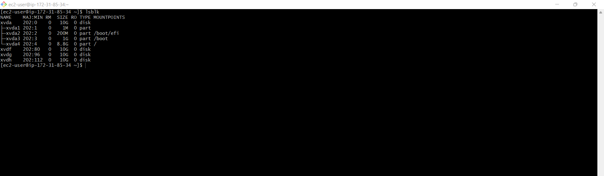

Use ```df -h``` command to see all mounts and free space on your server.

Use __gdisk__ utility to create a single partition on each of the 3 disks

```sudo gdisk /dev/xvdf```

type "?" to display the available options. Then "p" "which represents print the partition table".

From the options displayed, "n" represents "add a new partition".

Type "n" then "p" to display the new partition table.

Type "w" to write tabke on disk

Repeat process for the three disk i.e /dev/xvdf, /dev/xvdg, /dev/xvdh.

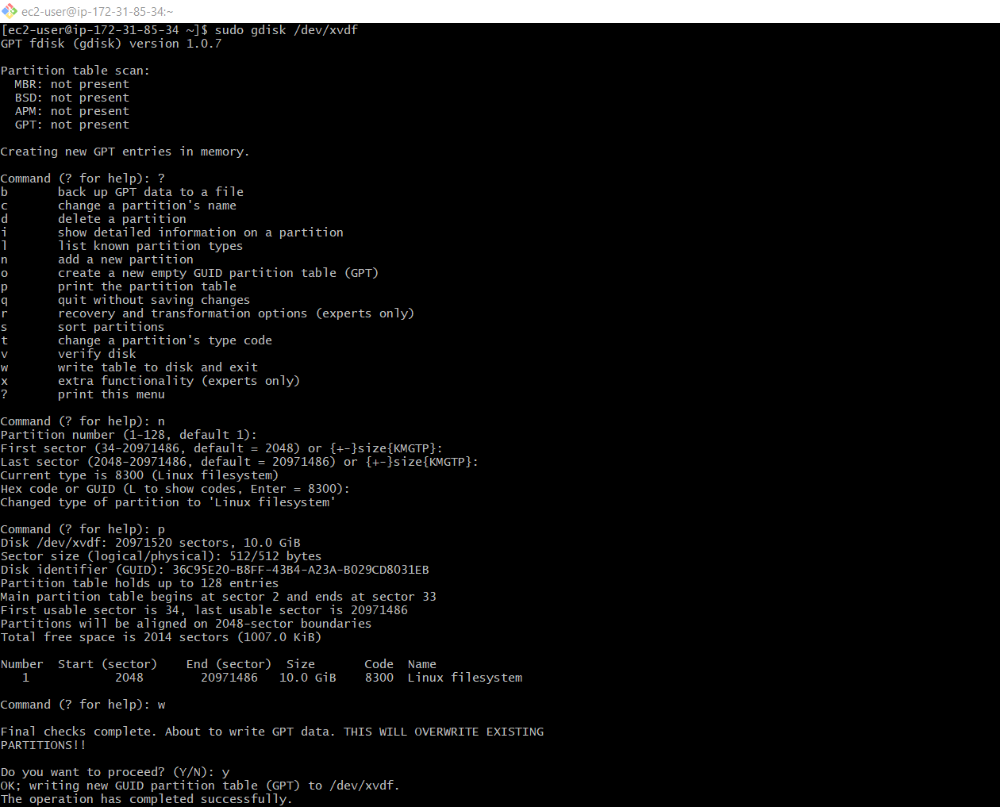

Use `lsblk` utility to view the newly configured partition on each of the 3 disks.

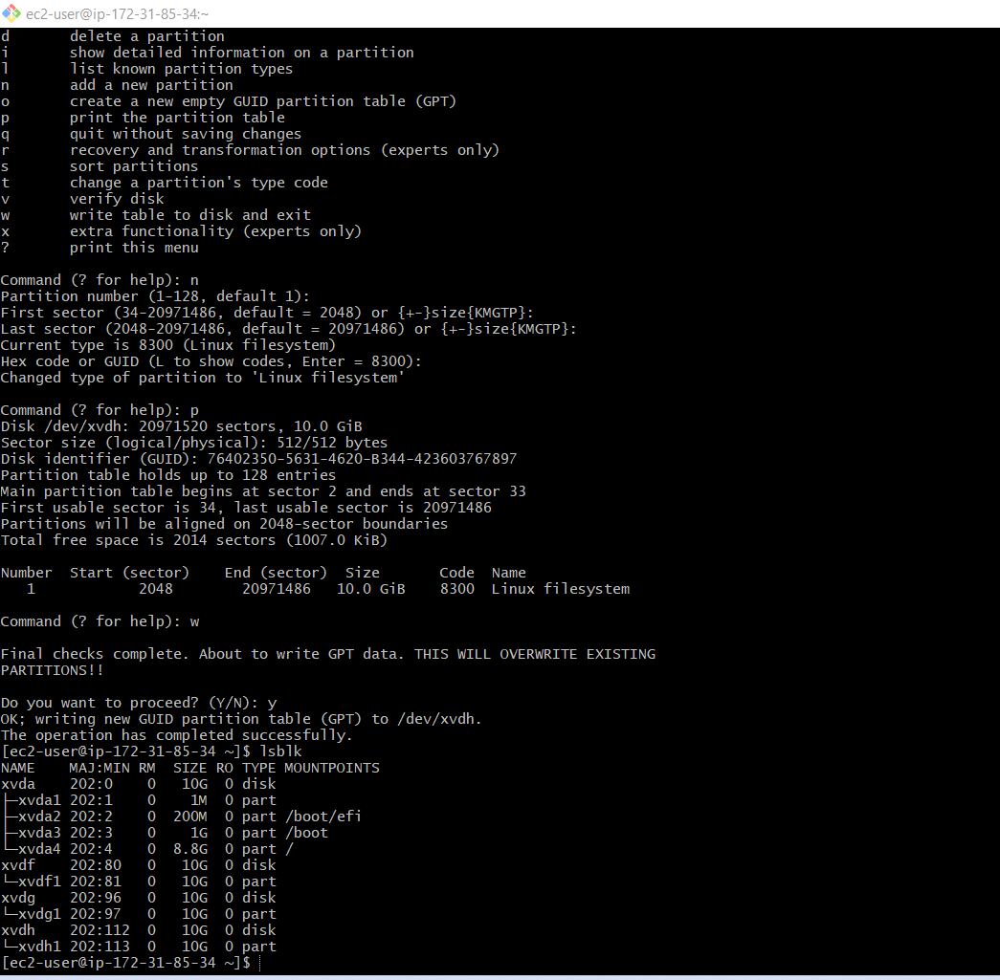

5. Install lvm2 package using `sudo yum install lvm2`. Run `sudo lvmdiskscan command to check for available partitions.

6. Use pvcreate utility to mark each of the 3 disks as physical volumes(PVs) to be used by LVM.
`sudo pvcreate /dev/xvdf1`
`sudo pvcreate /dev/xvdg1`
`sudo pvcreate /dev/xvdh1`

Verify that your physical volumes has been created successfully by running `sudo pvs`

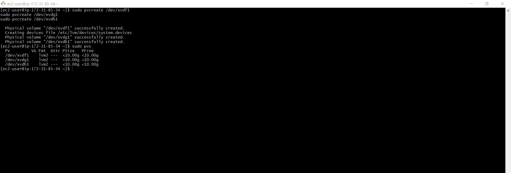

7. Use vgcreate utility to add all 3 PVs to a volume group (VG). Name the VG webdata-vg

`sudo vgcreate webdata-vg /dev/xvdh1 /dev/xvdg1 /dev/xvdf1`

verify that your VG has been successfully created by running `sudo vgs`
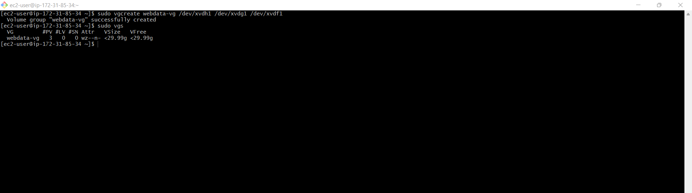

8. Use lvcreate utility to create 2 logical volumes. apps-lv (use half of the PV size), and logs-lv Use the remaining space of the PV size. Note: apps-lv will be used to store data for the website while, logs-lv will be used to store data for logs.

`sudo lvcreate -n apps-lv -L 14G webdata-vg`
`sudo lvcreate -n logs-lv -L 14G webdata-vg`

verify that logical volumes has been created successfully using by running `sudo lvs`

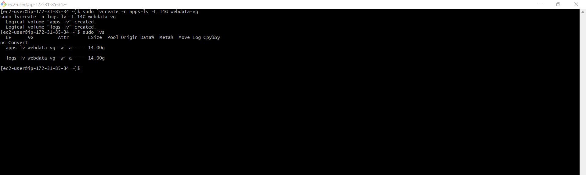

9. Verify the enire setup

`sudo vgdisplay -v #view complete setup - VG, PV, and LV`
`sudo lsblk`

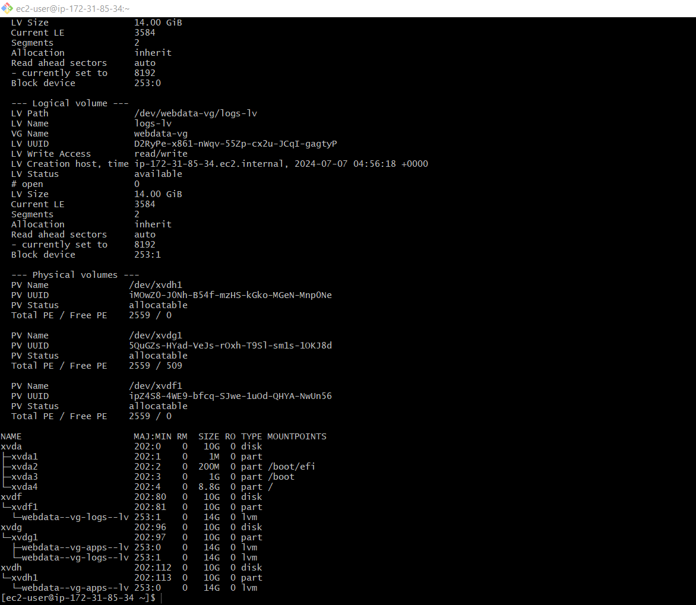


10. Use mkfs.ext4 to format the logical volumes with ext4 filesystem.

`sudo mkfs -t ext4 /dev/webdata-vg/apps-lv`
`sudo mkfs -t ext4 /dev/webdata-vg/logs-lv`

11. Create /var/www/html directory to store website files
`sudo mkdir -p /var/www/html`

12. Create /home/recovery/logs to store backup of log data
`sudo mkdir -p /home/recovery/logs`

13. Mount /var/www/html on apps-lv logical volume
`sudo mount /dev/webdata-vg/apps-lv /var/www/html/`

14. Use `rsync` utility to backup all the files in the log directory /var/log into /home/recovery/logs(This is required before mounting the file system)

`sudo rsync -av /var/log/. /home/recovery/logs/`

15. Mount /var/log on logs-lv logical volume (Note that all the existing data on /var/log will be deleted. That is why step 11 above is very important)

`sudo mount /dev/webdata-vg/logs-lv /var/log

16. Restore log files back into /var/log directory

`sudo rsync -av /home/recovery/logs/log/. /var/log`

17. Update /etc/fstab file so that the mount configuration will persist after restart of the server.

The UUID of the device will be used to update the `/etc/fstab` file.

`sudo blkid`

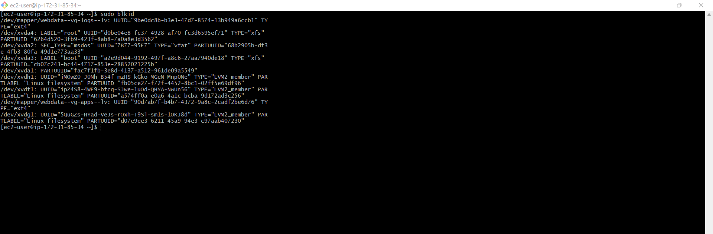 


18. Test the configuration and reload the daemon

`sudo mount -a`
`sudo systemctl daemon reload`

19. Verify your setup by running `df -h`, output must look like this: 

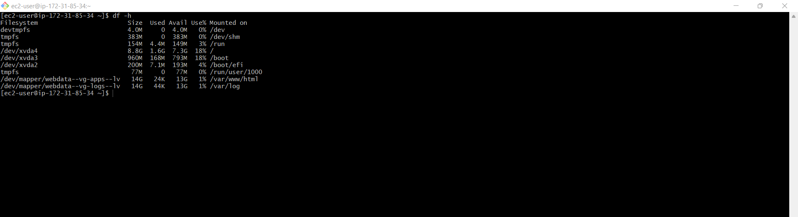


## Installing wordpress and configuring to use MySQL Database

1. - Prepare the Database Server
Launch a second RedHat EC2 instance that will have a role - 'DB Server' Repeat the same steps as for the Web Server but instead of `apps-lv` create `db-lv` and mount it to `/db` directly instead of `/var/www/html/`.

2. Install Wordpress on your Web Server EC2
   - Update the repository
  `sudo yum -y update`

   - Install wget, Apache and its dependencies
- `sudo yum -y install wget httpd php   php-mysql php-fpm php-json`

Start Apache
`sudo systemctl enable httpd`
`sudo systemctl start httpd`

To install PHP and it's dependencies
sudo yum install https://dl.fedoraproject.org/pub/epel/epel-release-latest-8.noarch.rpm
sudo yum install yum-utils http://rpms.remirepo.net/enterprise/remi-release-8.rpm
sudo yum module list php
sudo yum module reset php
sudo yum module enable php:remi-7.4
sudo yum install php php-opcache php-gd php-curl php-mysqlnd
sudo systemctl start php-fpm
sudo systemctl enable php-fpm
setsebool -P httpd_execmem 1

Restart Apache
`sudo systemctl restart httpd`

Download wordpress and copy wordpress to `var/www/html`

mkdir wordpress
cd   wordpress
sudo wget http://wordpress.org/latest.tar.gz
sudo tar xzvf latest.tar.gz
sudo rm -rf latest.tar.gz
cp wordpress/wp-config-sample.php wordpress/wp-config.php
cp -R wordpress /var/www/html/

Configure SELinux Policies

 sudo chown -R apache:apache /var/www/html/wordpress
 sudo chcon -t httpd_sys_rw_content_t /var/www/html/wordpress -R
 sudo setsebool -P httpd_can_network_connect=1

Install MYSQL on your DB Server EC2

`sudo yum update`
`sudo yum install mysql-server`

Verify that the service uo and running by using `sudo systemctl status mysqld`. if it is not running, restart the service and enable it so it will be running even after reboot:

`sudo systemctl restart mysqld`
`sudo systemctl enable mysqld`

Configure DB to work with WordPress
`sudo mysql`
`CREATE DATABASE wordpress;`
`CREATE USER `myuser`@`<Web-Server-Private-IP-Address>` IDENTIFIED BY 'mypass';
`GRANT ALL ON wordpress.* TO 'myuser'@'<Web-Server-Private-IP-Address>';
`FLUSH PRIVILEGES;`
`SHOW DATABASES;`
`exit`

Configure WordPress to connect to remote database.

Hint: Do not forget to open MySQL port 3306 on DB Server EC2. For extra security, you shall allow access to the DB Server ONLY from your Web Server's IP address, so in the inbound Rule configuration specify source as /32

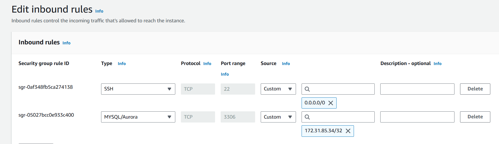

Install MySQL client and test that you can connect from your Web Server to your DB server by using `mysql client`

`sudo yum install mysql`
`sudo mysql -u admin -p -h <DB-Server-Private-IP-address>

Verify if you can successfully execute `SHOW DATABASES;` command and see a list of existing databases

Change permission and configuration so Apache could use WordPress:

Enable TCP port 80 in bound Rules configuration for your Webservere EC2 (enable from everywhere 0.0.0.0/0 or from your work station's IP)

Try to access from your browser the link to your WordPress `http://<web-server-Public-IP-Address>/wordpress/

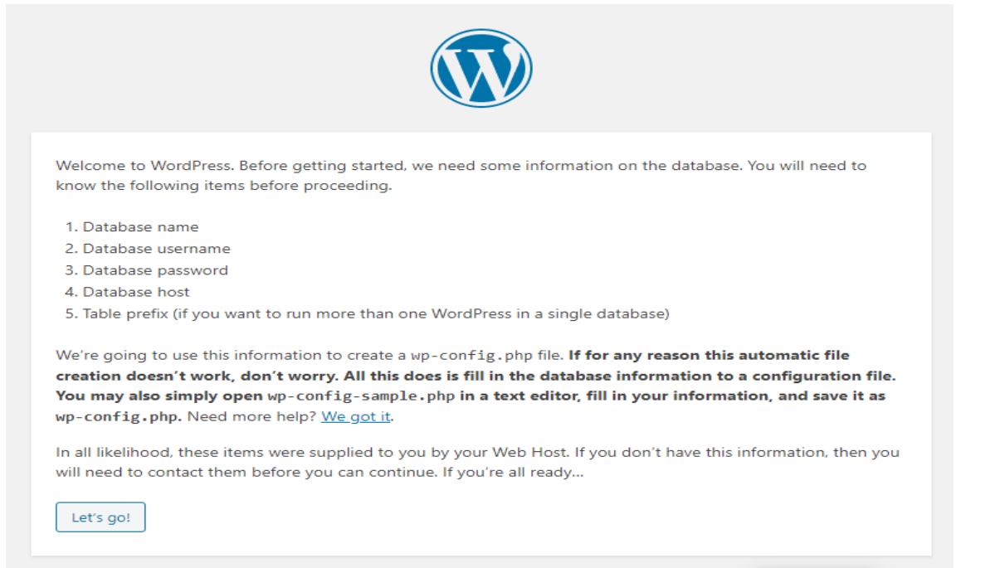

Fill out your DB credentials:

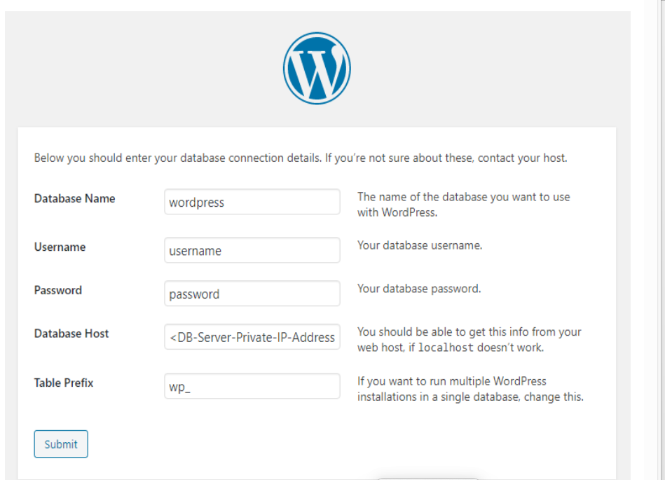

if you see this message it means your Wordpress has successfully connected to your remote MySqL database

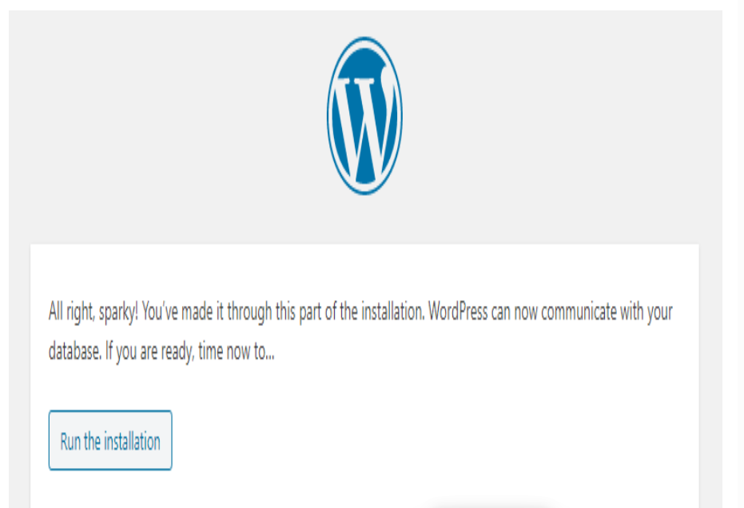


