# Implementing LVM on LInux servers (Web and Database servers)
This project involves being tasked to prepare storage infrastructure on two Linux servers and implement a basic web solution using WordPress. WordPress is a free and open-source content management system written in PHP and paired with MySQL or MariaDB as its backend Relational Database Management System (RDBMS).

This project consist of two parts:

1. Configure storage subsystems for Web and Database servers based on Linux OS. The focus of this part is to provide practical experience of working with disks, partitions and volumes in Linux.

2. Install Wordpress and connect it to a remote MySQL database server. This part of the project will solidify your skills of deploying Web and DB tiers of Web solution. 

## Three-tier Architecture

Three-tier Architecture is a client-server software architecture pattern that comprise of 3 seperate layers.

1. Presentation Layer: This is the user interface such as the client server or browser on your laptop.

2. Business Layer: This is the backend program that implements business logic. Application or Webserver.

3. Data Access or Management Layer: This is the layer for computer data storage and data access. Database server or File system Server such as FTP server or NFS Server.

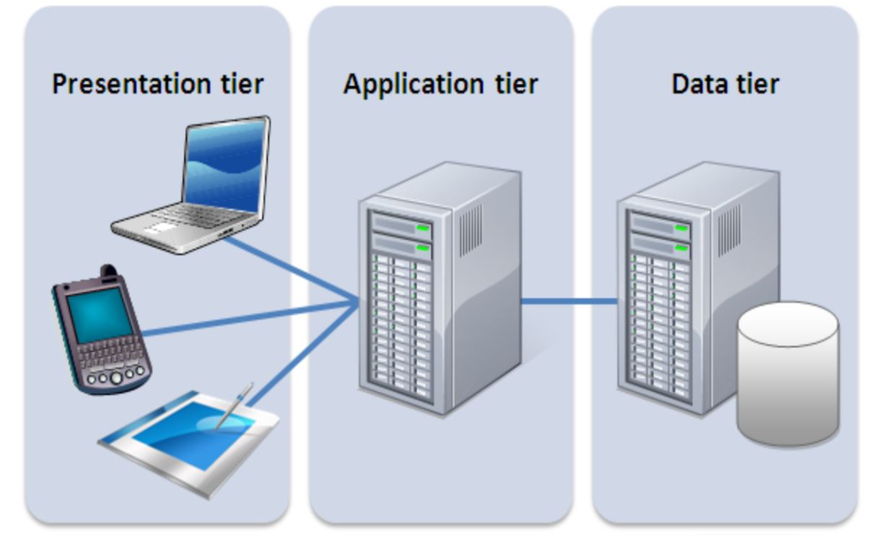

To implement LVM on Linux xservers follow the steps:

Step 1 - Prepare a Web Server

Launch and Ec2 instance that will serve as "Web Server". Create 3 volumes in the same AZ as your Web Server EC2, each of 10GB.

Presentation Layer (PL): This is the user interface such as the client server or browser on your laptop.
Business Layer (BL): This is the backend program that implements business logic. Application or Webserver.

Data Access or Management Layer (DAL): This is the layer for computer data storage and data access. Database Server or File System Server such as FTP server, or NFS Server.

In this project, we will showcase Three-tier Architecture while also ensuring that the disks used to store files on the Linux servers are adequately partitioned and managed through programs such as _gdisk_ and _LVM_ respectively.

Our 3-Tier Setup
1. A Laptop or PC to serve as a client.
2. An EC2 Linux Server as a web server (This is where you will install WordPress).
3. An EC2 Linux server as a database (DB) server.

We will use __RedHat OS(centos)__ for this project.

## LAUNCH AN EC2 INSTANCE THAT WILL SERVE AS “WEB SERVER”.

After logging into our AWS console, we go to __EC2__ and click on _"volume"_ under __Elastic block store(EBS)__.

Learn How to Add EBS volume to an EC2 instance [here](https://www.youtube.com/watch?v=HPXnXkBzIHw)

How to create an aws free tier account. click [here](https://www.youtube.com/watch?v=xxKuB9kJoYM&list=PLtPuNR8I4TvkwU7Zu0l0G_uwtSUXLckvh&index=7)

This launches us into the instance as shown in the screenshot:


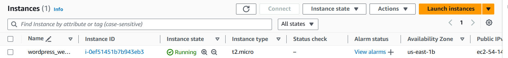

Click on __"create volume"__

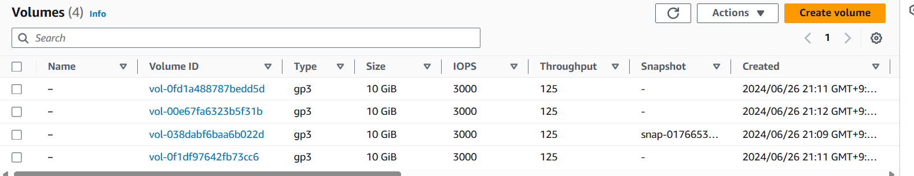

Open the Linux terminal, connect to the instance.

Use ```lsblk``` command to inspect what block devices are attached to the server. Notice names of your newly created devices. All devices in Linux reside in /dev/ directory. Inspect it with ls /dev/ and make sure you see all 3 newly created block devices there – their names will likely be xvdf, xvdh, xvdg.

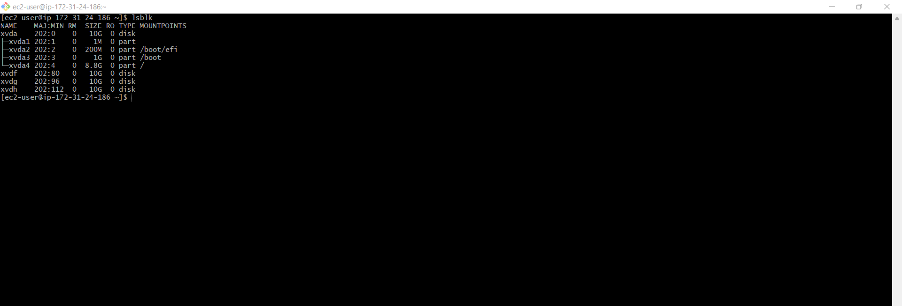

Use `df -h` command to see all mounts and free space on your server.

Use `gdisk` utility to create a single partition on each of the 3 disks.

`sud gdisk /dev/xvdf`

type "?" to display the available options . Then "P" "which represents print the partition table"

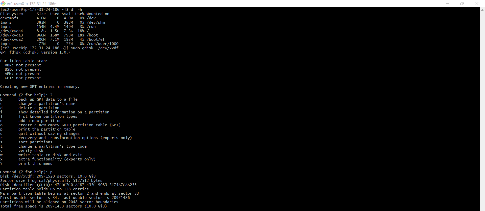

From the options displayed, "n" represents "add  a new partition".

Type "n" then "p" to display the new partition table.

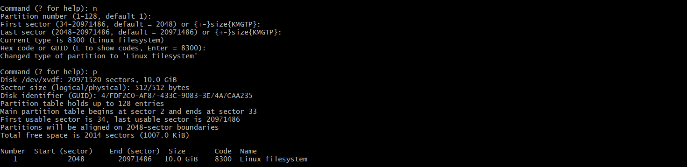

Type "w" to write table to disk

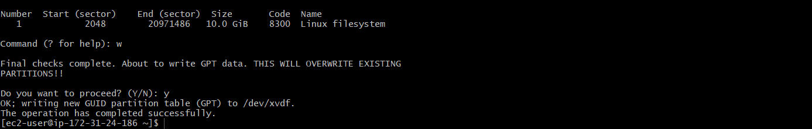

Repeat the process for the three disk i.e /dev/xvdf, /dev/xvdg, /dev/xvdh.

Use `lsblk` utility to view the newly configured partition on each of the 3 disk.


Install `lvm2` package using  `sudo yum install lvm2`

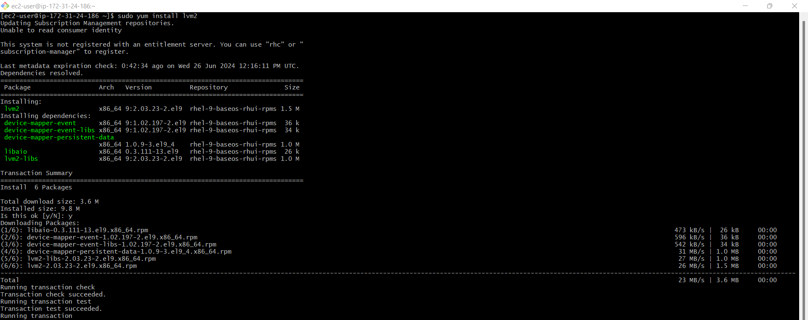

Run `sudo lvmdiskscan` to check available partitions.

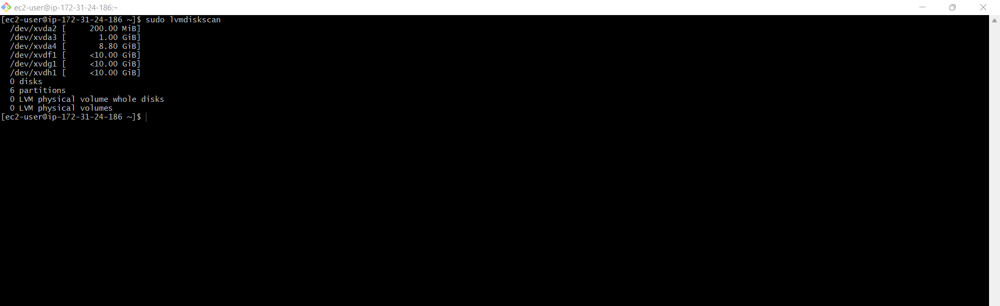

Use pvcreate utility to mark each of the 3 disks as physical volumes (PVs) to be used by LVM.

`sudo pvcreate /dev/xvdf1`
`sudo pvcreate /dev/xvdg1`
`sudo pvcreate /dev/xvdh1`

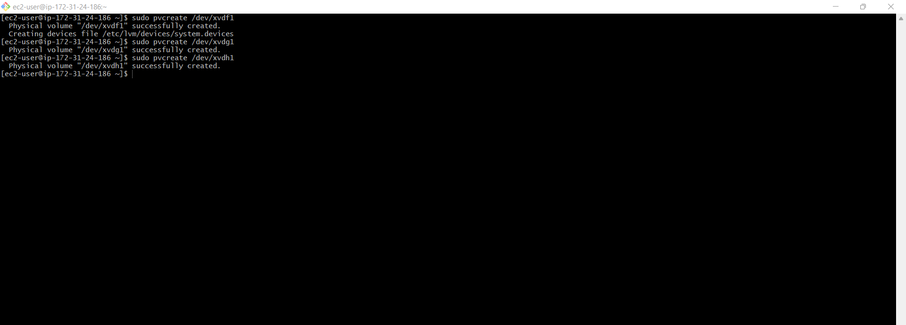

Verify that your physical volume has been created successfully by running `sudo pvs`

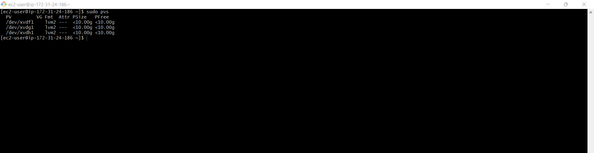

Use vgcreate utility to add all 3 PVs to a volume group (VG). Name the VG webdata-vg

`sudo vgcreate webdata-vg /dev/xvdh1 /dev/xvdg1 /dev/xvdf1`

Verify that your VG has been created successfully by running `sudo vgs`

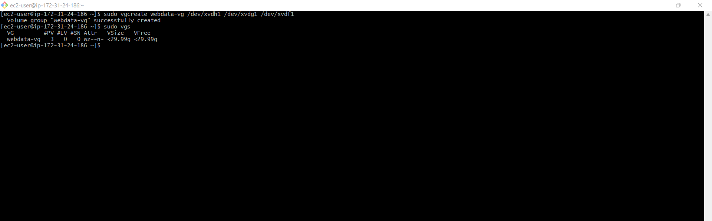

Use lvcreate utility to create 2 logical volumes. apps-lv (Use  half of the PV size), and logs-lv (Use the remaining space of the PV size).

The apps-lv will be used to store data for the Website wjile, logs-lv will be used to store data for logs. 

`sudo lvcreate -n apps-lv -L 14G webdata-vg`

`sudo lvcreate -n logs-lv -L 14G webdata-vg`

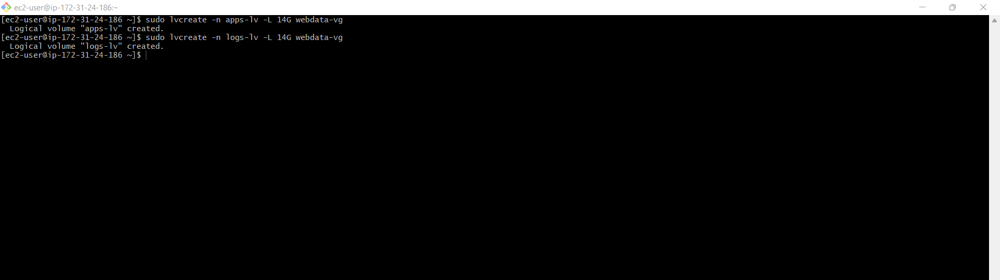

Verify that your Logical Volume has been created successfully by running `sudo lvs`

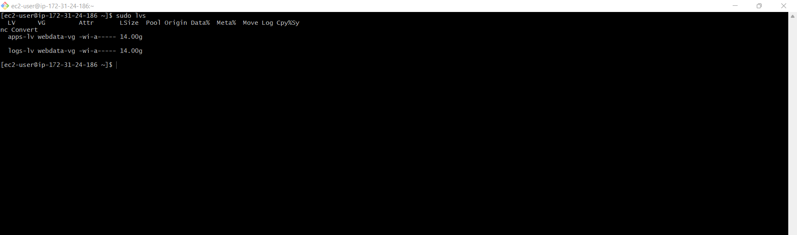

Verify the entire setup

`sudo vgdisplay -v #view complete setup -VG, PV, and LV`

`sudo lsblk`

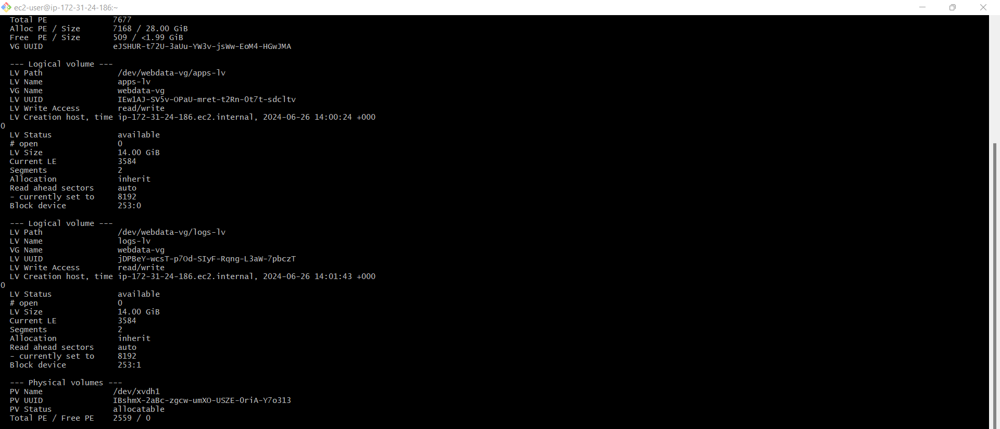

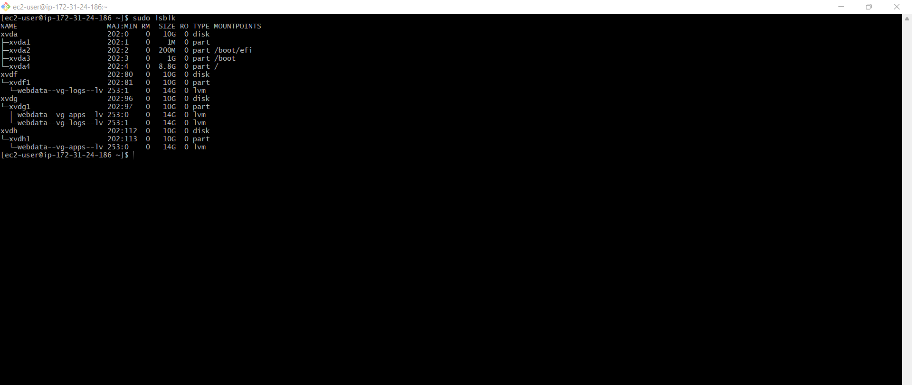

Use "mkfs.ext4" to format the logical volumes with "ext4" filesystem
`sudo mkfs -t ext4 /dev/webdata-vg/apps-lv`

`sudo mkfs -t ext4 /dev/webdata-vg/logs-lv`

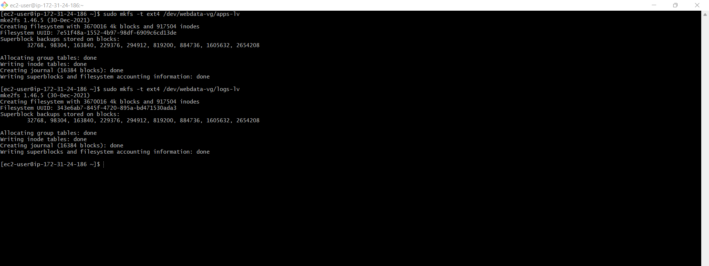

Create "/var/www/html" directory to store website files

`sudo mkdir -p /var/www/html`

Create /home/recovery/logs to store backup of log data

`sudo mkdir -p /home/recovery/logs`

Mount "/var/www/html" on "apps-lv" logical volume

`sudo mount /dev/webdata-vg/apps-lv /var/www/html/

Use rsync utility to backup all the files in the log directory "/var/log" into "/home/recovery/logs" (This is required before mounting the file system).

`sudo rsync -av /var/log/. /home/recovery/logs/`

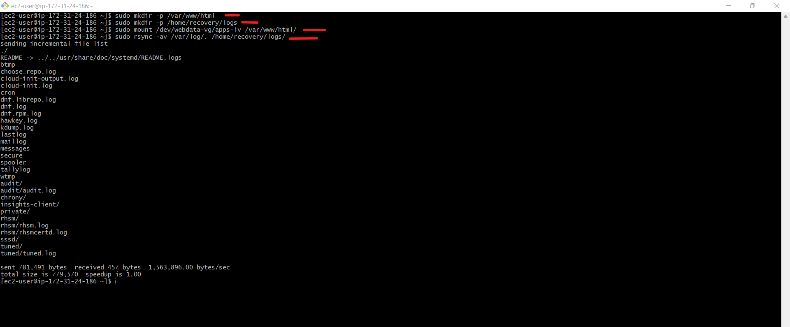

Update "/etc/fstab file" so that the mount configuration will persist after restart of the server.

UPDATE THE "/ETC/FSTAB" FILE.

The UUID of the device will be used to update the /etc/fstab file;

`sudo blkid`

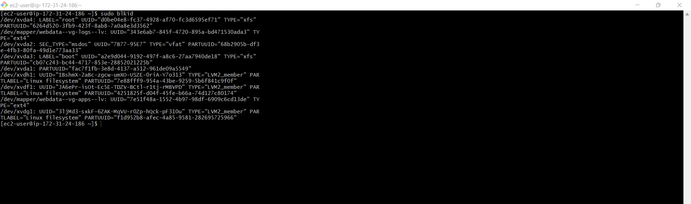

Open the "/etc/fstab"

`sudo vi /etc/fstab`

Update /etc/fstab in this format using your own UUID and rememeber to remove the leading and ending quotes.

Test the configuration by running this command. There will be no errors if everything is okay.

`sudo mount -a`

`df -h`


## Prepare the Database Server

Launch a second RedHat EC2 instance that will have a role - 'DB Server'. Repeat the same steps as for the webserver, but instead of apps-lv create db-lv and mount it to /db directory instead of /var/www/html/.

The apps-lv will be used to store data for the Website while, logs-lv will be used to store data for logs.

`sudo lvcreate -n db-lv -L 14G webdata-vg`

`sudo lvcreate -n logs-lv -L 14G webdata-vg`

Verify that your Logical Volume has been created successfully by running

`sudo lvs`

Verify the entire setup

`sudo vgdisplay -v #view complete setup - VG, PV, and LV`

`sudo lsblk`

Use mkfs.ext4 to format the logical volumes with ext4 filesystem.

`sudo mkfs -t ext4 /dev/webdata-vg/db-lv`

`sudo mkfs -t ext4 /dev/webdata-vg/logs-lv`

Create db directory to store database files

`sudo mkdir db`

Create /home/recovery/logs to store backup of log data

`sudo mkdir -p /home/recovery/logs`

Mount db/ on db-lv logical volume

`sudo mount /dev/webdata-vg/db-lv db/`

Use rsync utility to backup all the files in the log directory /var/log into /home/recovery/logs (This is required before mounting the file system).

`sudo rsync -av /var/log/. /home/recovery/logs/`

Mount /var/log on logs-lv logical volume. (all the existing data on /var/log will be deleted.)

`sudo mount /dev/webdata-vg/logs-lv /var/log`

Restore log files back into /var/log directory

`sudo rsync -av /home/recovery/logs/. /var/log`

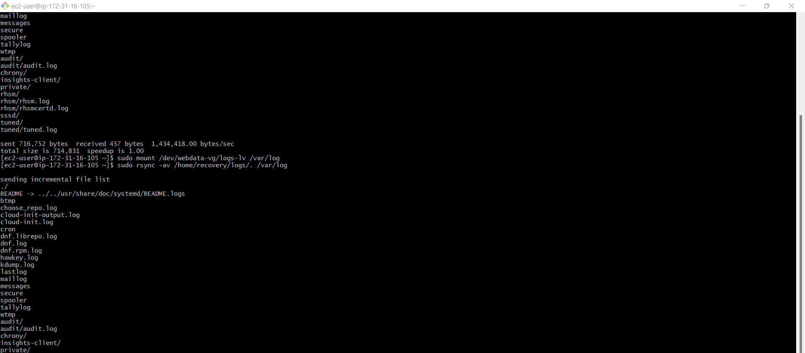

The UUID of the device will be used to update the /etc/fstab file;

`sudo blkid`


Open the "/etc/fstab" file.

`sudo vi /etc/fstab`

Update "/etc/fstab" in this format using your own UUID and rememeber to remove the leading and ending quotes.

Test the configuration for errors.

`sudo mount -a`

Reload daemon

`sudo systemctl daemon-reload`

Verify your setup by running

`df -h`

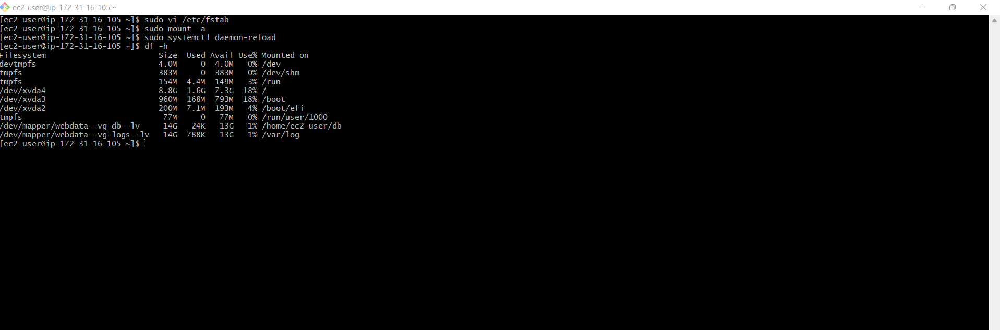

## Install WordPress on your Web Server EC2

Update the repository

`sudo yum -y update`

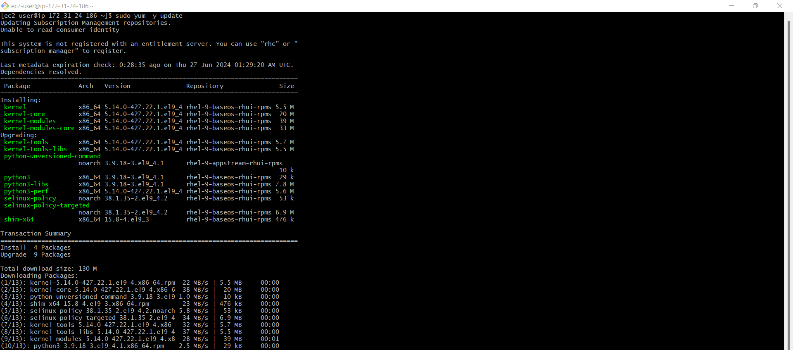

Install wget, Apache and it’s dependencies

`sudo yum -y install wget httpd php php-mysqlnd php-fpm php-json`

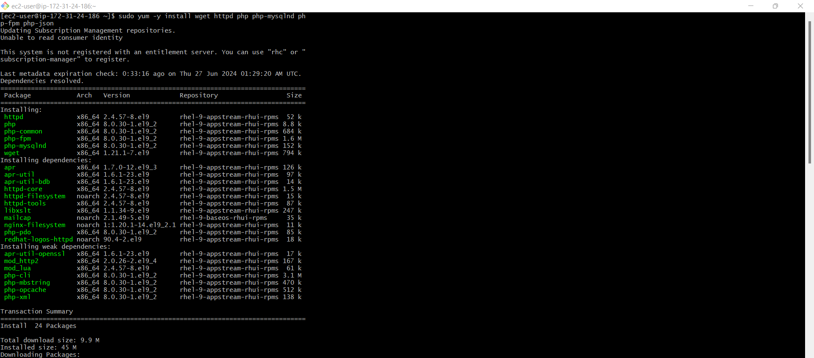

Start Apache

`sudo systemctl start httpd`

Enable Apache

`sudo systemctl enable httpd`

Verify Apache status

`sudo systemctl status httpd`

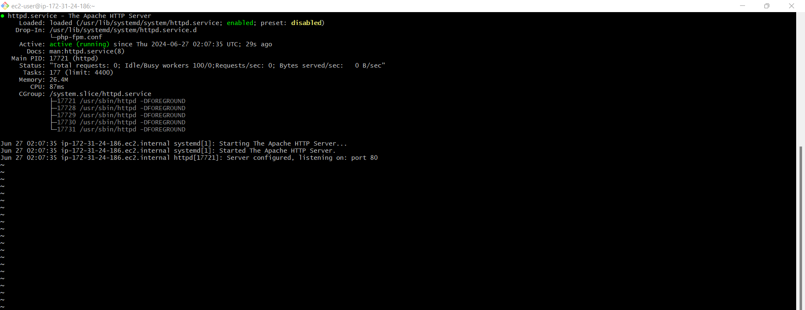

To install PHP and it’s depemdencies

`sudo yum install https://dl.fedoraproject.org/pub/epel/epel-release-latest-8.noarch.rpm`

`sudo yum install yum-utils http://rpms.remirepo.net/enterprise/remi-release-8.rpm`

`sudo yum module list php`

`sudo yum module reset php`

`sudo yum module enable php:remi-7.4`

`sudo yum install php php-opcache php-gd php-curl php-mysqlnd`

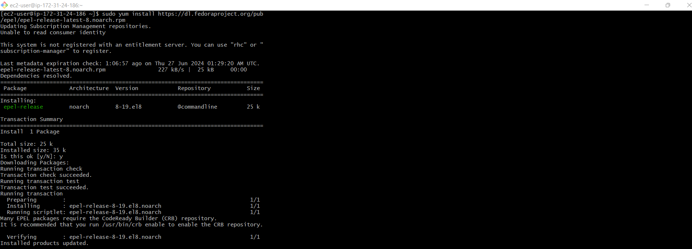
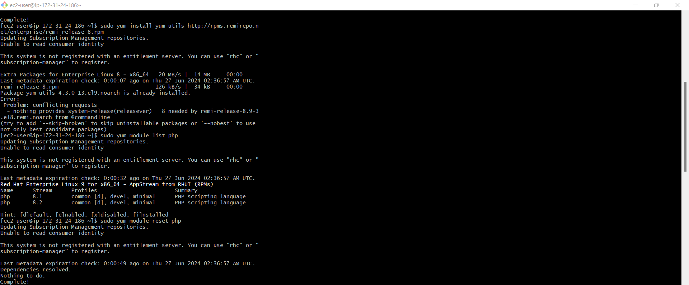
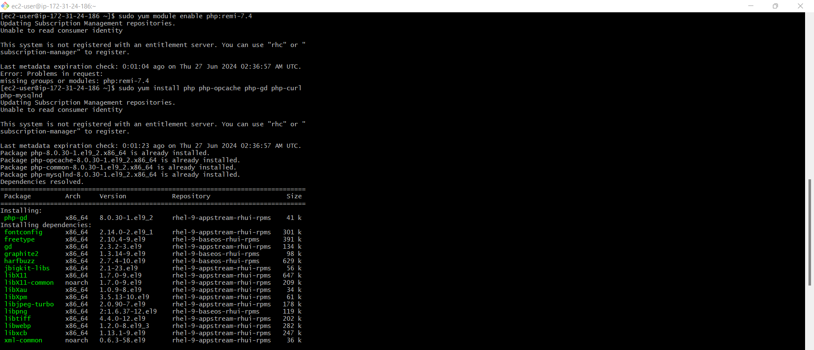
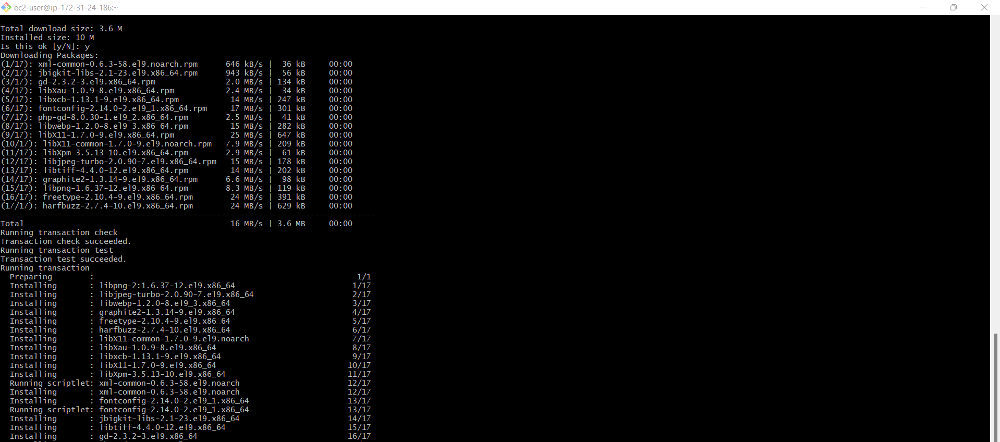
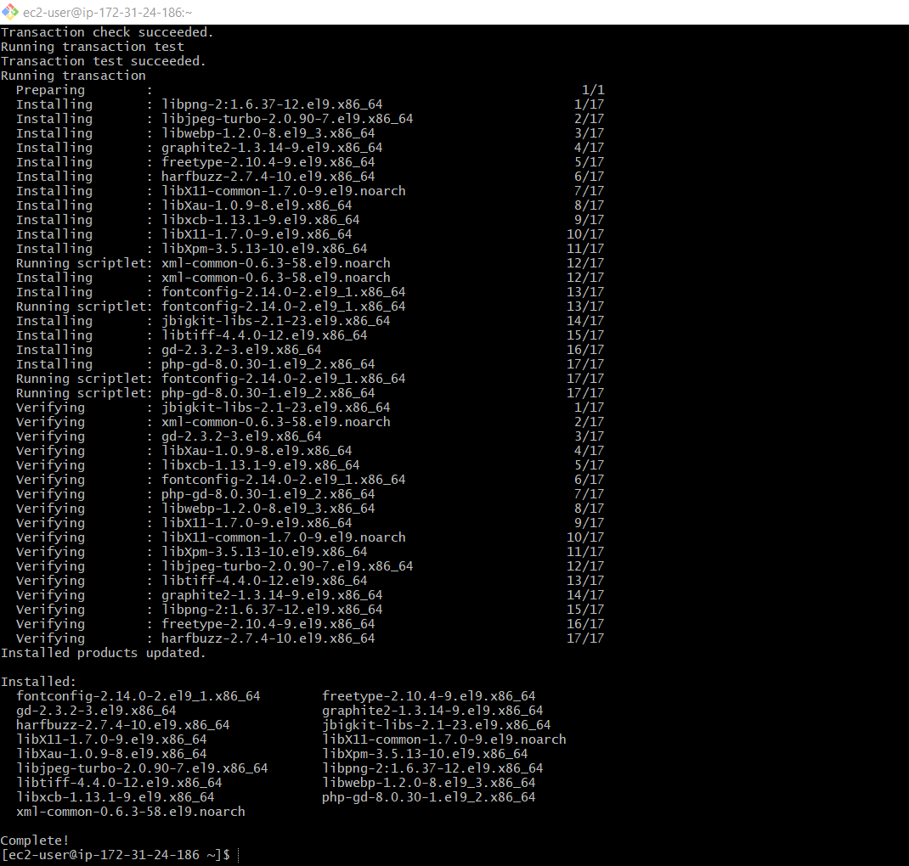

Start php and set policies

`sudo systemctl start php-fpm`

Enable php

`sudo systemctl enable php-fpm`

verify php status

`sudo systemctl status php-fpm`

`sudo setsebool -P httpd_execmem 1`

`Restart Apache`

`sudo systemctl restart httpd`

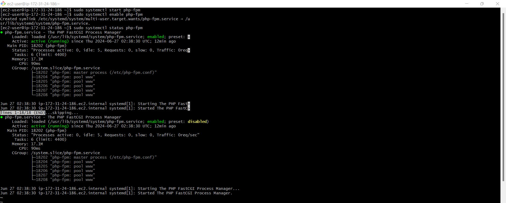

Copy the IP address of the webserver to the browser to see that the apache is working properly. (Edit inbound rule to port 80 on webserver)

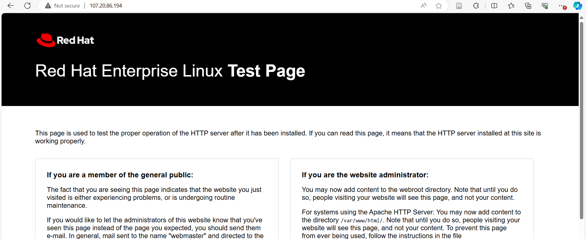

Download wordpress and copy wordpress to "var/www/html"

Create directory wordpress and cd into the directory.

`mkdir wordpress`

`cd   wordpress`

Download the wordpress file

`sudo wget http://wordpress.org/latest.tar.gz`

Unzip the file

`sudo tar xzvf latest.tar.gz`

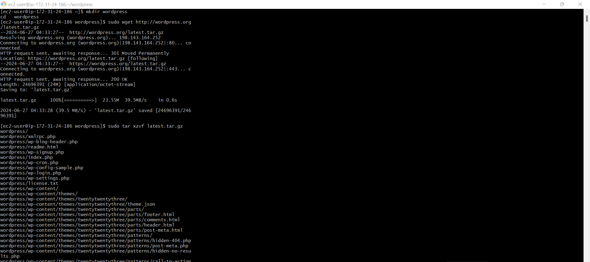

`sudo rm -rf latest.tar.gz`

Copy "wordpress/wp-config-sample.php" into "wordpress/wp-config.php"

N/B: wordpress/wp-config.php" will be created.

`sudo cp wordpress/wp-config-sample.php wordpress/wp-config.php`

Copy wordpress into "/var/www/html".

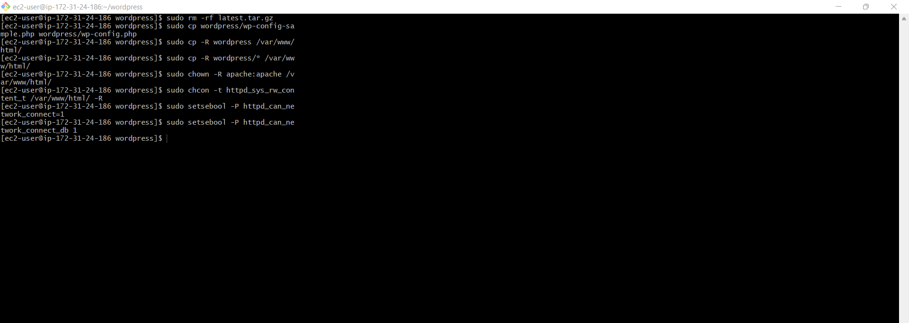

## Install MySQL on your DB Server EC2

Update the repository

`sudo yum update -y`


Install mysql-server

`sudo yum install mysql-server`

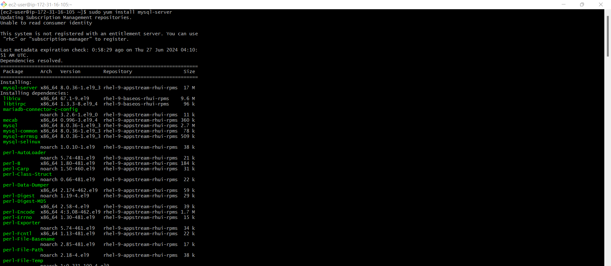

Verify that the service is up and running, if it is not running, restart the service and enable it so it will be running even after reboot:

`sudo systemctl restart mysqld`

`sudo systemctl enable mysqld`

`sudo systemctl status mysqld`

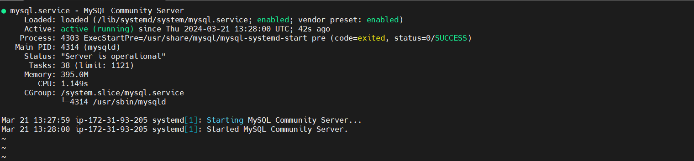

Configure DB to work with WordPress

`sudo mysql`

`mysql> ALTER USER 'root'@'localhost' IDENTIFIED WITH mysql_native_password BY 'PassWord.1';`

`mysql> exit;`

`sudo mysql_secure_installation`

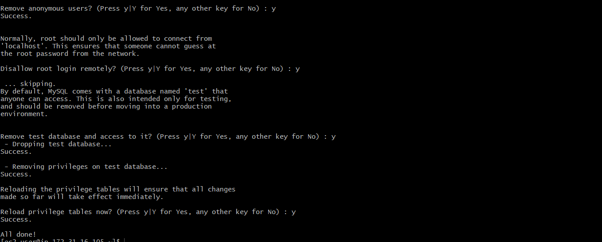

`sudo mysql -p`

`mysql> CREATE DATABASE `wordpress`;`

`mysql> CREATE USER 'myuser'@'%' IDENTIFIED WITH mysql_native_password BY 'S**la@@zaa';`

`mysql> GRANT ALL ON example_database.* TO 'myuser'@'%';`

`mysql> exit;`

`mysql -u example_user -p`

`mysql> SHOW DATABASES;`

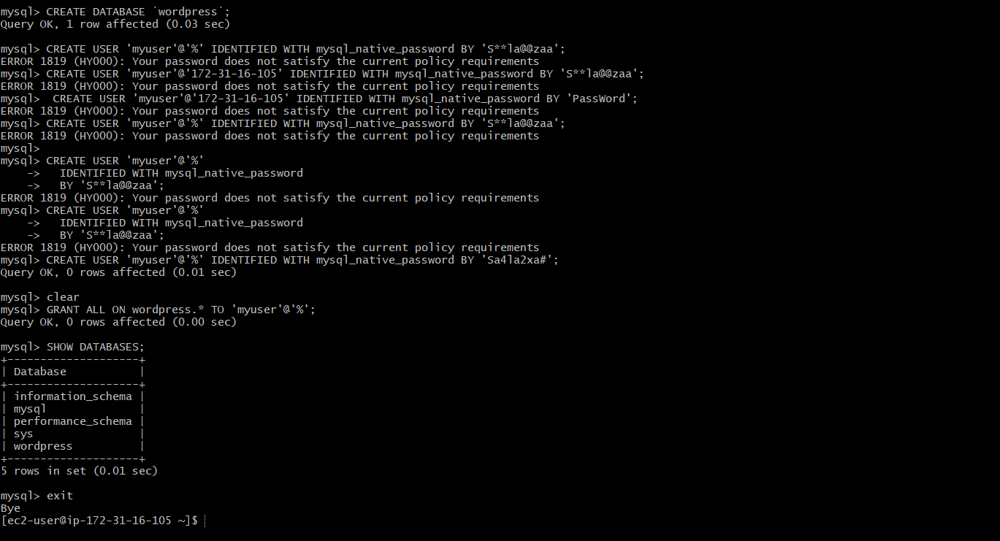

Open MySQL port 3306 on DB Server EC2. For extra security, you shall allow access to the DB server ONLY from your Web Server’s IP address, so in the Inbound Rule configuration specify source as /32

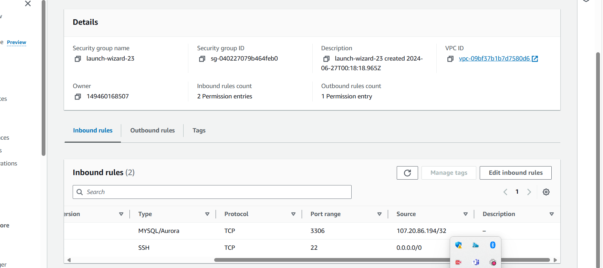

Install MySQL client and test that you can connect from your Web Server to your DB server by using mysql-client.

`sudo yum install mysql`

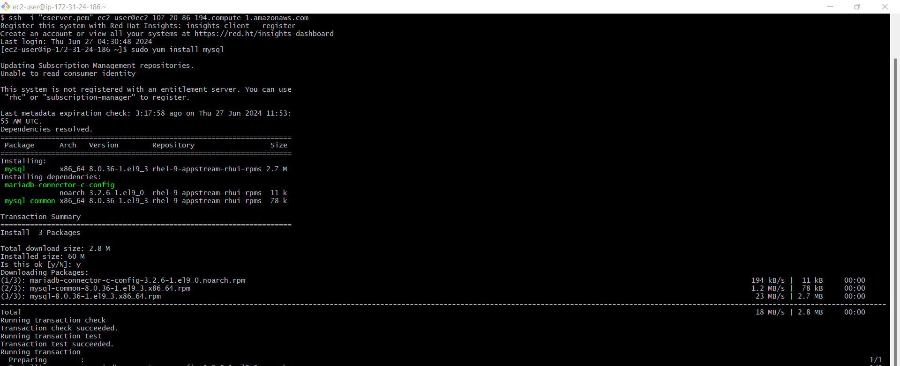

Connecting webserver to DBserver and Verify if you can successfully execute SHOW DATABASES; command and see a list of existing databases.

`sudo mysql -u myuser -p -h <DB-Server-Private-IP-address>`


