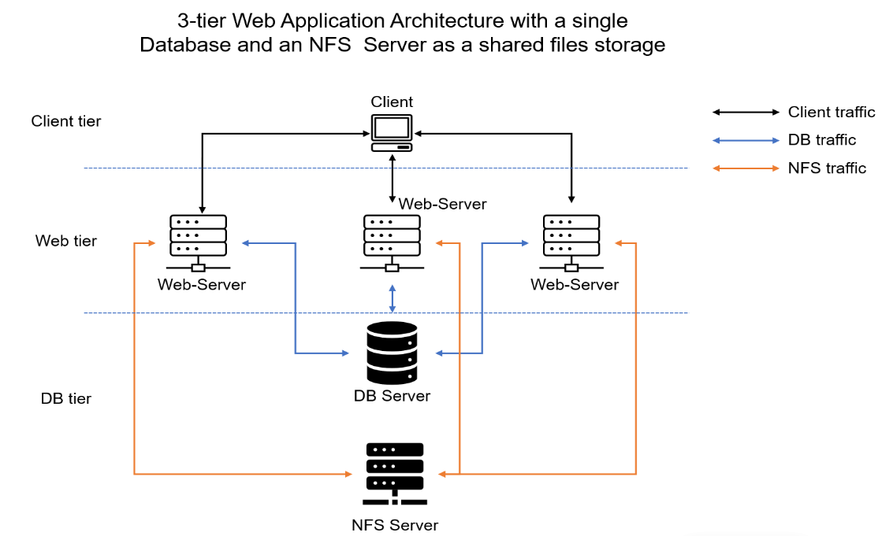

# DEVOPS TOOLING WEBSITE SOLUTION
## Side Self Study

Read about Network-attached storage (NAS), Storage Area Network (SAN) and related protocols like NFS, (s)FTP, SMB, and iSCSI. Explore what Block-level storage is and how it is used by Cloud Service providers, and know the difference from Object storage. On the example of AWS services understand the difference between Block Storage, Object Storage and Network File System.

## Setup and technologies for this project
As a member of a DevOps team, you will implement a tooling website solution which makes access to DevOps tools within the corporate infrastructure easily accessible. In this project you will implement a solution that consists of following components:

1. Infrastructure: AWS
2. Webserver Linux: Three Red Hat Enterprise Linux 8
3. Database Server: One Ubuntu 20.04 + MySQL
4. Storage Server: One Red Hat Enterprise Linux 8 + NFS Server
5. Programming Language: PHP
6. Code Repository: GitHub On the diagram below you can see a common pattern where several stateless Web Servers share a common database and also access the same files using Network File Sytem (NFS) as a shared file storage. Even though the NFS server might be located on a completely separate hardware – for Web Servers it look like a local file system from where they can serve the same files.

It is important to know what storage solution is suitable for what use cases, for this – you need to answer the following questions: what data will be stored, in what format, how this data will be accessed, by whom, from where, how frequently, etc. Based on this you will be able to choose the right storage system for your solution.

## STEP 1 – PREPARE NFS SERVER

1. Spin up a new EC2 instance with RHEL Linux 8 Operating System.
   Based on your LVM experience from the three-tier architecture project, Configure LVM on the Server.
   
   Instead of formatting the disks as ext4, you will have to format them as xfs
