# Linux Project for Commands

## `sudo` command

sudo means superuser do. It allows you to execute commands that need administrative rights and its shown below.

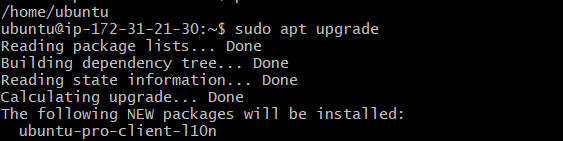

## `pwd` command

pwd is an acronym for present working directory. It is a command that displays the path of the directory where you are currently located in the file system.

## `cd` command

cd means change directory and usually a directory is specified. It takes a single argument, which is the path of the directory to switch to. If no argument is given, it changes to the user's home directory.

## `ls` command 

ls means list. it list the files and directories within a system. To see the directories content, type `ls` followed by the desired path.

As an example, `ls -a` shows hidden files in addition to the visible ones.

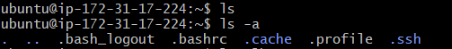

## `cat` command

cat means concatenate. it list, combines and writes file content to the standard output. To run the cat command, type cat followed by the file name and its extension.

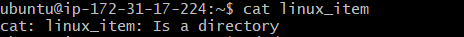

## `cp` command

cp means copy. The command is a useful tool for copying files or directories and their content. It can be used to create backups, duplicate data, or move files between different locations.

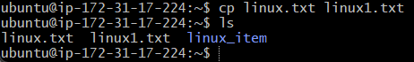

## `mv` command

mv command The mv command is a useful tool for moving and renaming files and directories in a Linux system. It has the following syntax: mv [options] source destination. The source can be one or more files or directories, and the destination can be a single file or directory. The mv command will move the source to the destination, and if the destination already exists, it will overwrite it. If the source and destination are on the same filesystem, the mv command will simply rename the source. Otherwise, it will copy the source to the destination and delete the original source.

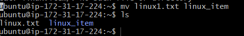

## `mkdir` command

The mkdir command allows you to create new directories in a specified location and assign them different permissions. You can use this command to make one or more directories at the same time.

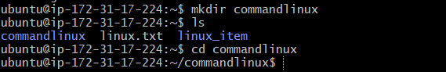

## rmdir command 

rmdir stands for remove directory. It is a command that deletes an empty directory from the file system.

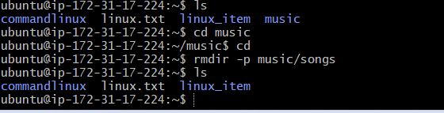
## `rm` command

rm command is used to delete files within a directory. The command can also be used to remove multiple files.

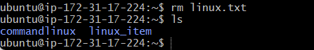

## `touch` command 

With the touch command, you can create a new file without any content or update the access and modification times of an existing file in the linux command line. This command is useful for testing, scripting, or creating placeholder files.

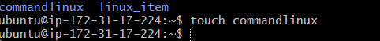

## `locate` command 

locate command is a useful tool for finding a file in the database system. It can search for a file name even if it is not typed exactly as it is stored. To do this, the -i argument can be added to the locate command, which will ignore the case sensitivity of the file name.

## `find` command

find command is used to search for files within a specific directory and perform subsequent operations. 

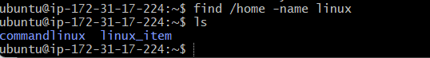

## `grep` command

grep means global regular expression print. It is a useful tool for finding a specific word in a single file. It can scan the entire text and return the lines that contain the word. This is helpful for filtering large log files that may have a lot of irrelevant information.

## `df` command

df command is used to report the system's disk space usage, shown in percentage and kilobyte(KB)

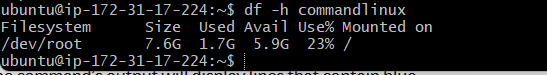

## `du` command

du command check how much space a file or a directory takes up.This command can also identify which part of the system uses the storage excessively. 

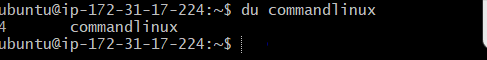

##  `head` command

The head command is useful for displaying the beginning of a text. You can specify how many lines you want to see with an option.

## `tail` command 

tail command displays the last ten lines of a file. it allows users to check whether a file has new data or to read error messages.

## `diff` command

diff means difference. this command compares two contents of a file line by line and displays the part that does not match.

## `tar` command

tar command archives files into a TAR file - a common linux format similar to ZIP, with optional compression. 
