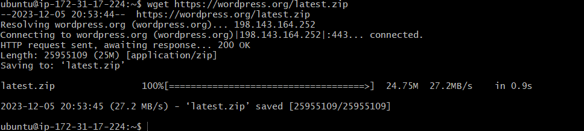
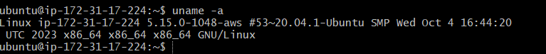

# Linux Project for Commands

1. ## `sudo` command

sudo means superuser do. It allows you to execute commands that need administrative rights and its shown below.

2. ## `pwd` command

pwd is an acronym for present working directory. It is a command that displays the path of the directory where you are currently located in the file system.

3. ## `cd` command

cd means change directory and usually a directory is specified. It takes a single argument, which is the path of the directory to switch to. If no argument is given, it changes to the user's home directory.

4. ## `ls` command 

ls means list. it list the files and directories within a system. To see the directories content, type `ls` followed by the desired path.

As an example, `ls -a` shows hidden files in addition to the visible ones.

5. ## `cat` command

cat means concatenate. it list, combines and writes file content to the standard output. To run the cat command, type cat followed by the file name and its extension.

6. ## `cp` command

cp means copy. The command is a useful tool for copying files or directories and their content. It can be used to create backups, duplicate data, or move files between different locations.

7. ## `mv` command

mv command The mv command is a useful tool for moving and renaming files and directories in a Linux system. It has the following syntax: mv [options] source destination. The source can be one or more files or directories, and the destination can be a single file or directory. The mv command will move the source to the destination, and if the destination already exists, it will overwrite it. If the source and destination are on the same filesystem, the mv command will simply rename the source. Otherwise, it will copy the source to the destination and delete the original source.

8. ## `mkdir` command

The mkdir command allows you to create new directories in a specified location and assign them different permissions. You can use this command to make one or more directories at the same time.

9. ## rmdir command 

rmdir stands for remove directory. It is a command that deletes an empty directory from the file system.

10. ## `rm` command

rm command is used to delete files within a directory. The command can also be used to remove multiple files.

11. ## `touch` command 

With the touch command, you can create a new file without any content or update the access and modification times of an existing file in the linux command line. This command is useful for testing, scripting, or creating placeholder files.

12. ## `locate` command 

locate command is a useful tool for finding a file in the database system. It can search for a file name even if it is not typed exactly as it is stored. To do this, the -i argument can be added to the locate command, which will ignore the case sensitivity of the file name.

13. ## `find` command

find command is used to search for files within a specific directory and perform subsequent operations. 

14. ## `grep` command

grep means global regular expression print. It is a useful tool for finding a specific word in a single file. It can scan the entire text and return the lines that contain the word. This is helpful for filtering large log files that may have a lot of irrelevant information.

15. ## `df` command

df command is used to report the system's disk space usage, shown in percentage and kilobyte(KB)

16. ## `du` command

du command check how much space a file or a directory takes up.This command can also identify which part of the system uses the storage excessively. 

17. ##  `head` command

The head command is useful for displaying the beginning of a text. You can specify how many lines you want to see with an option.

18. ## `tail` command 

tail command displays the last ten lines of a file. it allows users to check whether a file has new data or to read error messages.

19. ## `diff` command

diff means difference. this command compares two contents of a file line by line and displays the part that does not match.

20. ## `tar` command

tar command archives files into a TAR file - a common linux format similar to ZIP, with optional compression. 

# File Permissions and Ownership

21. ## `chmod` command

chimod is a command that modifies a file or directory's read,write, and execute permissions. This command support optios such as `-c` or changes displays information when a change is made. 

.PNG)

22. ## `chown` command

chown command lets you change the ownership of a file, directory, or symbolic link to a specified username. the basic format: `chown [option] owner[ :group] file(s)`

23. ## jobs command

jobs command will display all the running processes along with their statuses. jobs syntx is: `jobs [options] jobID`

24. ## kill command 

kill command terminates an unresponsive program manually. it will signal misbehaving applications and instruct them to close processes. The proces identification number (PID) is important to kill a program. to get the PID run: `ps ux` then `kill [signal_option]`

25. ## `ping` command

ping command is used for checking whether a network or a server is reachable. it is also used to toubleshoot various connectivity issues. the format is:
`ping [option] [hostname_or_address]`

26. ## `wget` command

`wget`command retrieves files from the internet using HTTP, HTTPS, and FTP protocols. 

27. ## `uname` command 

uname command will print detailed information about your linux system and hardware

28. ## `top` command

The top command in linux terminal shows all the processes that are running and how the system is using its resources in real time. It gives a summary of the CPU and memory usage.

29. ## `history` command

history command when execute the system will list up to 500 previously executed commands, allowing you to resue them without re-entering. Only users with sudo privileges can execute this command. The command supports many options such as `-c` clears the complete history list. `-d` offset deletes the history entry at the OFFSET position. -a appends history lines.

30. ## `man` command

man command provides a user manual of any commands or utilities you can run in Terminal, including the name, description, and options. Section 2 of the ls command manual is: `man 2 ls`

31. ## `echo` command 

echo command is a built in utility that displays a line of text or string using the standard output. 

32. ## `zip`, `unzip` commands

zip command is used to compress files into a ZIP file, and it can automatically choose the best compression ratio. it is used to also achive files and directories and reducing disk storage. The syntax: `zip archive.zip note.txt` and `unzip archive.zip`

33. ## `hostname` command

hostname command when executed show the system's hostname. it can be executed with or without an option.  The syntax is `hostname [option]` .

34. ## `useradd`, `userdel` commands

useradd command is used to create a new account, while passwd command allows you to add a password. while userdel command is to delete a user.
syntax: `useradd [option] username`and `userdel username`

35. ## `apt-get` command

apt-get is a command retrieves information and bundles from authenticated sources to manage, update, remove, and install software and its dependencies. The syntax is: `apt get [option] (command)` 

36. ## `nano`, `vi`, `jed commands

nano command denotes keywords and can work with most languages `nano filename`

vi commad uses two modes to work-insert and command.insert is for edit and creat file. While the command performs operations, such as savings, opening, copying, and pasting a file.

jed command has a drop-down that allows users to peform actions without entering keyboard combinations or commands.

37. ## `alias`, `unalias` command
    
alias command allows you to create a shortcut with the same functionality as a command, file name, or text. While unalias command deletes an existing `alias`.

`alias Name=String` and `unalias [alias_name]`

38. ## `su` command
    
`su` means switch user. this command allows you to runa program as a different user.it changes the administrative account in the current log-in session. The command is especially beneficisl for accessing the system through SSH or using the GUI display manager when the root useris unavailable. The general syntax:
`su [options] [username [argument]]`

39. ## htop command 

`htop` command is an interactive program that monitors system resources and server processes in real time. the syntax is `htop [options]`

40. ## ps command

ps command produces snapshot of all running processes in your system. The static results are taken from the virtual files in the /proc system

