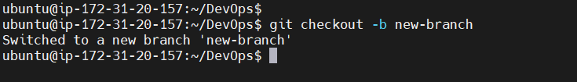
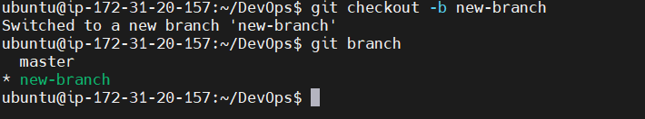
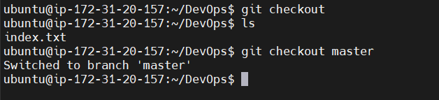
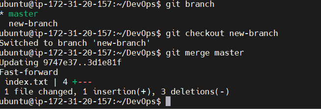
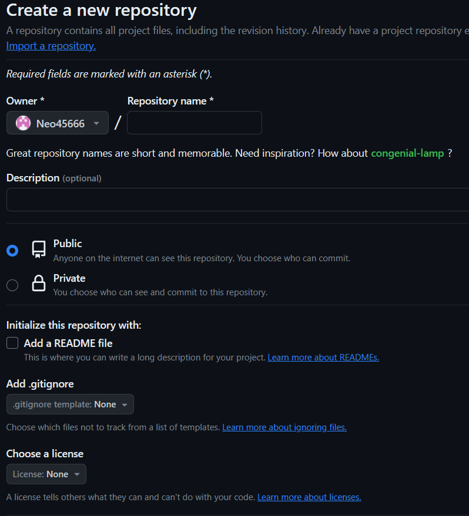
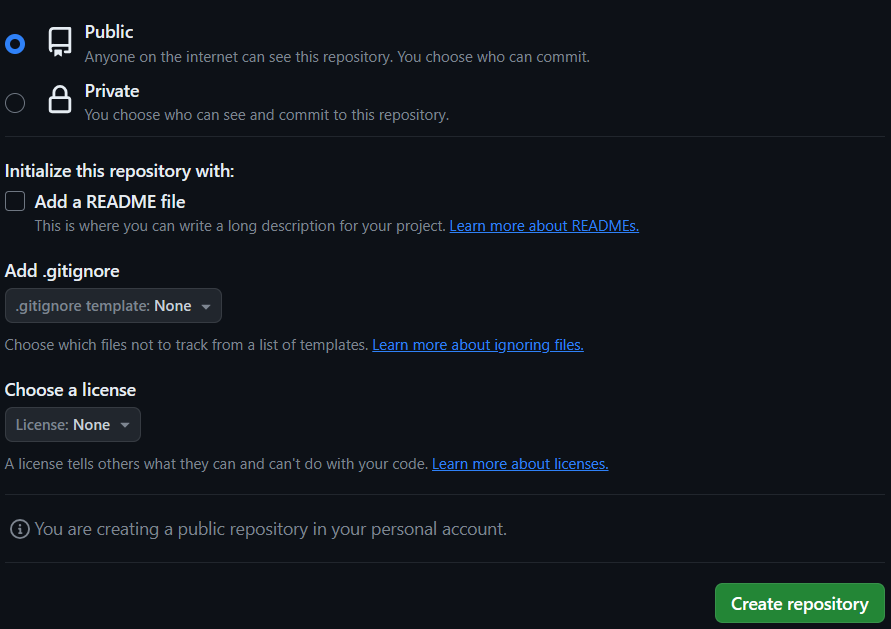

# GIT Project for Repositories and Commits 

## Initializing a GIT Repository

step 1:  is to create a working folder/directory e.g DevOps folder using the command `mkdir DevOps`

step 2: Change into working folder/directory using the command `cd DevOps`

step 3: while inside the folder , run `git init` command

## Making the first commit

step 1: Create a file index.txt inside the working directory using the command `touch index.txt`

step 2: Compose any sentence you prefer into the text document and then save the modifications.

step 3: Add your changes to git staging area using this command `git add .`

step 4: To commit your changes to git, run the command `git commit -m initial commit`

The -m flag is used to provide a message. The commit message should be as descriptive as possible.

## Working with Branches and making a git branch

Make new branch by running the command `git checkout -b my-new-branch`

For listing of branches, use the command `git branch`

## Change into an Old branch

Use the command `git checkout master`

 

## Merging a branch into another branch 

Merging refers to addition of the content of branch B into A using the comand `git merge B`

## Delecting a git branch

Git branch can be deleted with the command `git branch -d`

# Colaborations and Remote Repositories

## Creating a github account
step 1: Join github.com 
step 2: enter username, password, and email.
step 3: click on the verify button to verify identity
step 4: click on create button to create account
step 5: An activation code is sent to your personal email,enter the code in textboxes provided then click continue
step 6: select your preferences and click continue.A list of github plans will show up, then click continue for free.

## creating first repository
step 1: click on the plus sign at the top right coner of your github account. A drop down menu will appear,select new repository

step 2: fill out the form by adding a repository name, description and tickeing the box to add a Readme.md file.

step 3: click the green button below to create repository

 ## Pushing your local repository to your remote github repository

 step 1: use the command `git remote add origin <link to your github repo>`

 step 2: committing your changes in your local repo. You push the content to the remote repo using the command `git push origin <branch name>`

 ## Cloning Remote Git Repository

 The git clone command is used to make a copy of remote repository in our local machine. The command `git clone <link to your remote repository>`

 # Branch Management and Tagging 

 ## Markdown Syntax
 Markdown is commonly used for creating documents, README.files, forum posts, and even web pages. The most commonly used syntax are:

 1. Headings: to create heading,the hash symbol at the beginning of the line. The number of hash symbol indicate the level of ther heading. 
 `# Heading 1`
 `## Heading 2`
 `### Heading 3`

 2. Emphasis: asterisks or underscore is used to emphasis text
`*italic* or _italic`_
`**bold** or __bold__`

3. Lists: markdown has support for both ordered and unordered list
   unordered lists - 
  `Item 1`
- `Item 2`
- `Item 3`

   ordered list 
`1. First item`
`2. Second item`
`3. Third item`

4. Links: to create hyperlink, use the square brackets for the link text followed by parenthesis containing the URL
  `[visit darey.io](https://www.darey.io)`

5. Images: to display an image use an exclamation mark followed by a square bracket for the alt text and parenthesis containing the image URL
  ``

6. Code: To display code or code snippets use backticks (`) to enclose the code.

 `console.log('Welcome to darey.io')`

