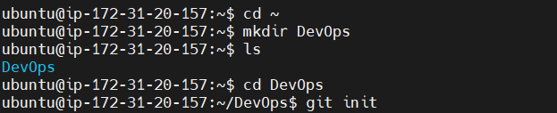
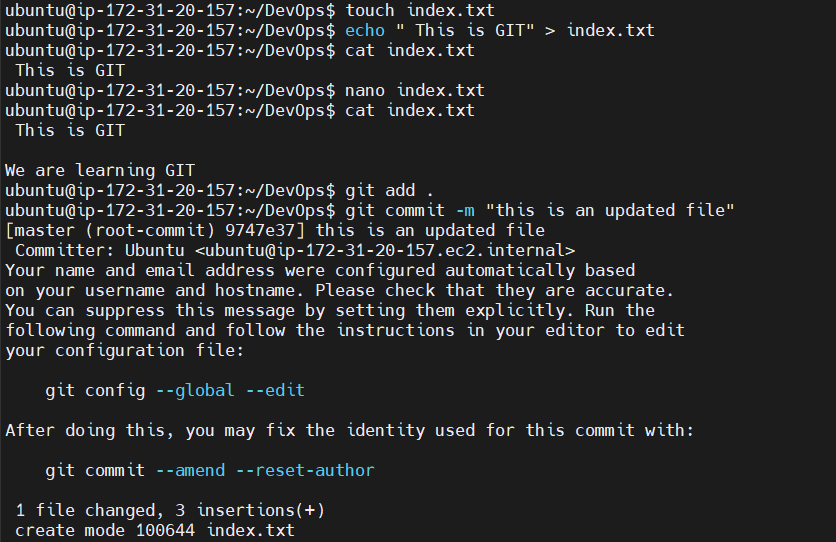

# GIT Project for Repositories and Commits 

## Initializing a GIT Repository

step 1:  is to create a working folder/directory e.g DevOps folder using the command `mkdir DevOps`

step 2: Change into working folder/directory using the command `cd DevOps`

step 3: while inside the folder , run `git init` command

## Making the first commit

step 1: Create a file index.txt inside the working directory using the command `touch index.txt`

step 2: Compose any sentence you prefer into the text document and then save the modifications.

step 3: Add your changes to git staging area using this command `git add .`

step 4: To commit your changes to git, run the command `git commit -m initial commit`

The -m flag is used to provide a message. The commit message should be as descriptive as possible.

