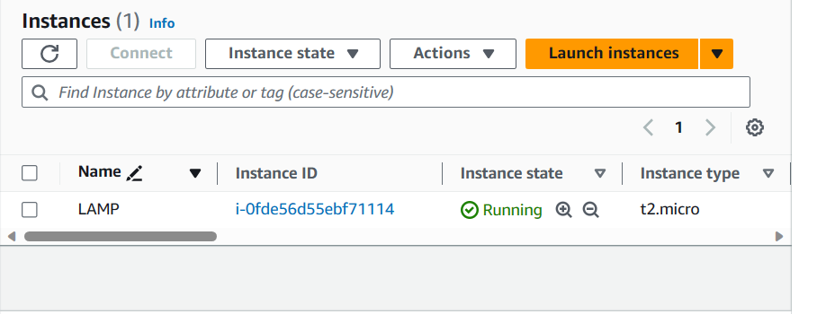
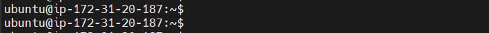
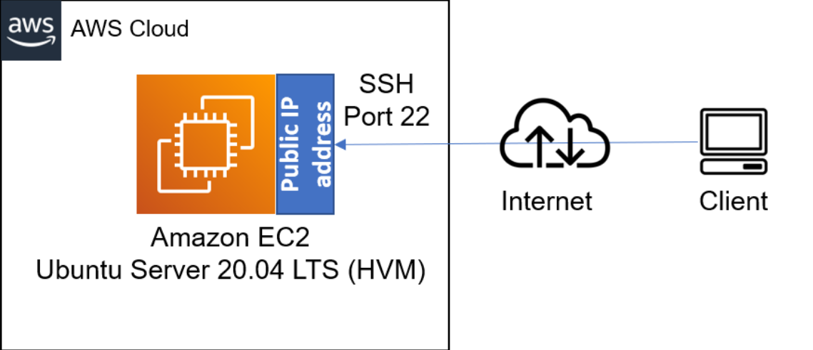
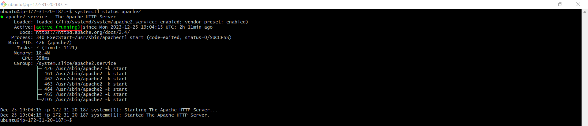
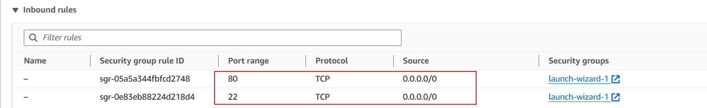
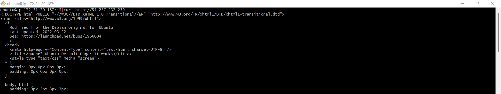
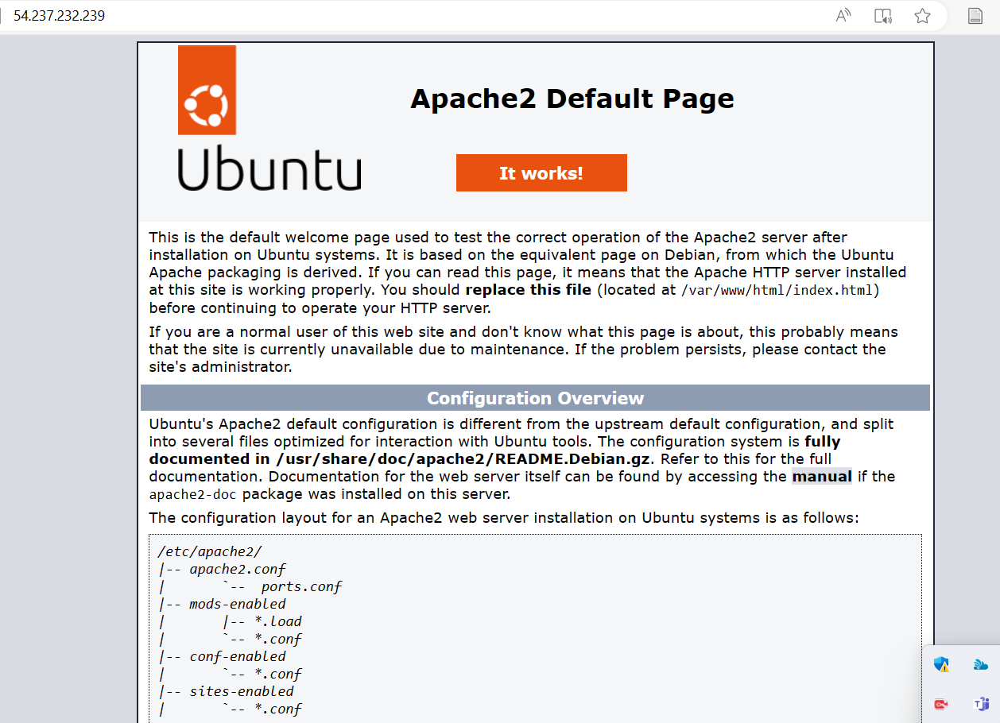
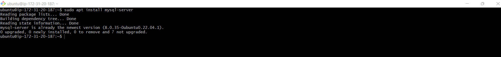
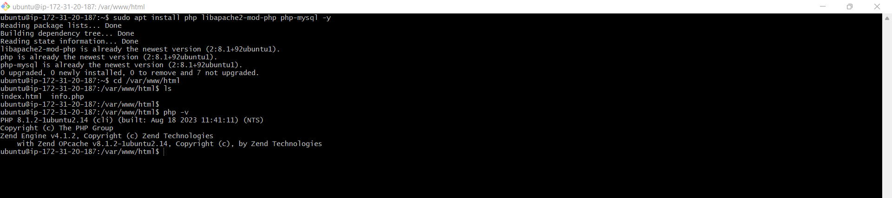
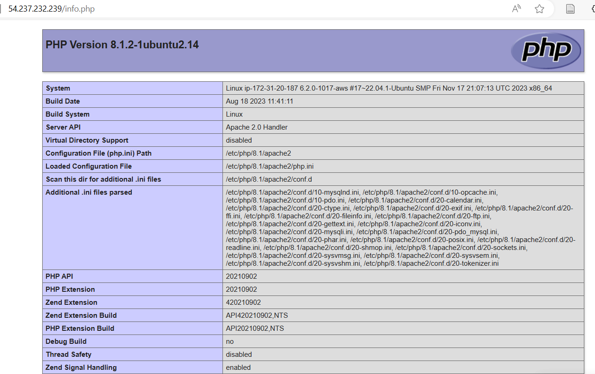

# LAMP STACK IMPLEMENTATION (Linux, Apache, MySQL, PHP or Python) ON AWS

## About The Project

This project covers essential topics suchs as setting up a Linux environment, configuring the Apache webserver, managing MySQL databases, and writing PHP code for server-side functionality. The project will equip one with the expertise to leverage the power of the LAMP stack and build robust, scalable, and secure web applications.

## Prerequisites

- AWS account setup and Provisioning an Ubuntu Server 

- Connecting to an EC2 Instance

`ssh -i <private-key-name>.pem ubuntu@<Public-IP-address>`

- Linux server successful setup

Connection architecture diagram:
  

Successful login into ec2 instance
## STEP 1 - INSTALLING APACHE WEB SERVER

Install Apache via Ubuntu Package Manager 
`apt`

Update a list of packages in package manager
`sudo apt update`

Run apache2 package installation  
`sudo apt install apache2`

To verify that Apache2 is running as a service in the OS

`sudo systemctl status apache2`

The text that shows "Active" indicates that Apache webserver is live.

## Configuring Security Group Inbound Rules on EC2 Instance

A Security Group functions as a collection of rules resembling a virtual firewall, managing the flow of incoming (inbound) and outgoing (outbound) traffic for an instance.

Upon instance creation, a default TCP rule is activated on port 22, facilitating SSH connections to a terminal. To guarantee accessibility of our webpages from the internet, it's essential to establish an inbound TCP rule for port 80.

To check assessibility of web server on the Ubuntu shell:

`curl http://localhost:80`or `curl http://127.0.0.1:80`

To check if Apache HTTP server can respond to request from the internet,open a web browser and try to access following url

## STEP 3 - INSTALLING MYSQL

With the Apache web server operational, the next step involves installing a Database Management System (DBMS) to store and manage data for the site. MySQL, a relational database management system commonly utilized within PHP environments, will be employed for this particular project

Again, use `apt` to acquire and install this software:

`sudo apt install mysql-server -y`

Log into the MySQL console by typing

`sudo mysql`

This will connect to the MySQL server as the administrative database root user, which is inferred by the use of `sudo` when running this command 

Define the users password using this command 
`ALTER USER 'root'@'localhost' IDENTIFIED WITH mysql_native_password BY 'password';`

Exit the MySQL shell with the command:

`mysql> exit`

Start the interactive script by running:

`sudo mysql_secure_installation`

This will ask if you want to configure the `VALIDATE PASSWORD PLUGIN`

Note: If enabled, passwords which don't match the specified criteria will be rejected by MySQL with an error. it is safe to leave validation disabled, but you should always use strong, unique passwords for database credentials.

Answer `Y` for yes, or anything else to continue without enabling.

The MySQL server is now install

`VALIDATE PASSWORD PLUGIN can be used to test passwords`
`and improve security. It checks the strength of password`
`and allows the users to set only those passwords which are`
`secure enough. Would you like to setup VALIDATE PASSWORD plugin?`

`Press y|Y for Yes, any other key for No:`

if the answer is "yes", you'll be asked to select a level of password validation.

## STEP 4-INSTALLING PHP

Apache has been installed to serve content and MySQL installed to store and manage your data. PHP is the component of our setup that will process code to display dynamic content to the end user. 

In addition to the `php` package, you'll need `php-mysql`, a PHP module that allows PHP to communicate with MySQL-based databases. You'll need `libapache2-mod-php` to enable Apache to handle PHP files. Core PHP packages will automatically be installed as dependencies. 

To install these 3 packages at once, run: 

`sudo apt install php libapache2-mod-php php-mysql`

Once the installation is finished you can run the following command to confirm your PHP version:

`php -v`

At this point, LAMP stack is completely installed and fully operational.

## STEP 5-ENABLE PHP ON THE WEBSITE

With the default DirectoryIndex settings on Apache, a file named `index.html` will always take precedence over an `index.php` file. This is useful for setting up maintenance pages in PHP applications, by creating a temporary `index.html` file containing an informative messag to visitors. Because this page will take precedence over the `index.php` page, it will then become the landing page for the application. Once maintenance is over, the `index.html` is renamed or removed from the document root , bringing it back to the regular application page.

in case you want to change this behaviour, you'll need to edit the `/etc/apache2/mods-enabled/dir.conf`

After saving and closing the file, you will need to reload Apache so the changes take effect:

`sudo systemctl reload apache2`

Finally create a PHP script to test that PHP is correctly installed and configured on the server.
Create a new file named `index.php` inside your custom web root folder:

`vim /var/www/projectlamp/index.php`

This will open a blank file. Add the following text, which is valid PHP code, inside the file:

<?php
phpinfo();

When finished save and close the file, refresh the page and you will see a page similar to this: 

