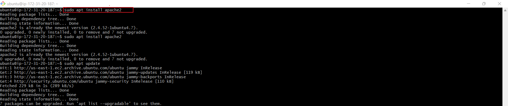

# LAMP STACK IMPLEMENTATION (Linux, Apache, MySQL, PHP or Python) ON AWS

## About The Project

This project covers essential topics suchs as setting up a Linux environment, configuring the Apache webserver, managing MySQL databases, and writing PHP code for server-side functionality. The project will equip one with the expertise to leverage the power of the LAMP stack and build robust, scalable, and secure web applications.

## Prerequisites

- AWS account setup and Provisioning an Ubuntu Server 

- Connecting to an EC2 Instance

`ssh -i <private-key-name>.pem ubuntu@<Public-IP-address>`

- Linux server successful setup

Connection architecture diagram:
  

Successful login into ec2 instance
## STEP 1 - INSTALLING APACHE WEB SERVER

Install Apache via Ubuntu Package Manager 
`apt`

Update a list of packages in package manager
`sudo apt update`

Run apache2 package installation  
`sudo apt install apache2`

To verify that Apache2 is running as a service in the OS

`sudo systemctl status apache2`

The text that shows "Active" indicates that Apache webserver is live.

## Configuring Security Group Inbound Rules on EC2 Instance

A Security Group functions as a collection of rules resembling a virtual firewall, managing the flow of incoming (inbound) and outgoing (outbound) traffic for an instance.

Upon instance creation, a default TCP rule is activated on port 22, facilitating SSH connections to a terminal. To guarantee accessibility of our webpages from the internet, it's essential to establish an inbound TCP rule for port 80.

To check assessibility of web server on the Ubuntu shell:

`curl http://localhost:80`or `curl http://127.0.0.1:80`

To check if Apache HTTP server can respond to request from the internet,open a web browser and try to access following url

