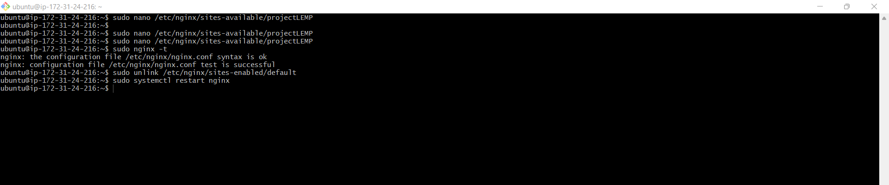

# WEB STACK IMPLEMENTATION - DEPLOYING LEMP STACK (Linux, NGINX, MySQL and PHP) ON AWS

A LEMP Stack application is an application which as opposed to a LAMP stack application makes use of Nginx as the web server for hosting the web application. NGINX is an open source software for web serving, reverse proxying, caching, load balancing, media streaming, and more.

## Prerequisites
- Cloud Service Provider - AWS, Azure, GCP, etc.
- Launch a Linux Instance (Ubuntu preferably).
- Prior knowledge on how to SSH into a virtual host.

## Step 1 - Creating an Ubuntu EC2 Instance
Login to AWS Cloud Service console and create an Ubuntu EC2 instance. The virtual machine is a linux operating system which serves as the backbone for the LEMP Stack web application. 

## Installing NGINX Webserver
Run a `sudo apt update` to download package information from all configured sources.

Then use the command `sudo apt install nginx -y` to install nginx

To verify that Nginx was successfully installed and running as a service in Ubuntu, run:

`sudo systemctl status nginx`

Before any traffic can be received by the webserver, we need to open a TCP port 80 which is default port that web browsers use to access web pages in the internet

Open a web browser of your choice and try to access following url  
http://Public-IP-Address:80

## Step 3 - Installing MySQL

A Database Management SDystem (DBMS) will be installed to store and manage data for your site in a relational database. MySQL is a popular relational database management system used within PHP environment.
Again, `apt` is used to acquire and install this software: 

`sudo apt install mysql-server -y`

Provide added security to our mysql server by running `sudo apt install mysql-secure_installation`. This script will remove some insecure default settings and look down access to our database system.

 

MySQL sucessfully installed 

With mysql_server successfully configured, login into the mysql server.

To exit from the webserver 

 

## Step 4 - Installing PHP and its Modules

We use php to dynamically display contents of our webpage to users who make requests to the webserver.

You have Nginx installed to serve your content and MySQL installed to store and manage your data. We can then install PHP to process code and generate dynamic content for the webserver.

Run `sudo apt install php-fpm php-mysql`

you now have PHP components installed. Next , you will configure Nginx to use them.

## Step 5 - Configuring Nginx to use PHP Processor

When using the Nginx web server, we can create server blocks (similar to virtual hosts in Apache) to encapsulate configuration details and host more than one domain on a single server.

Create the root web directory for your domain as follows:  
`sudo mkdir /var/www/projectLEMP`

Next, assign ownership of the directory with the $USER environment variable, which will reference your current system user:  
`sudo chown -R $USER:$USER /var/www/projectLEMP`

Create a new configuration file in Nginx’s sites-available directory  
`sudo nano /etc/nginx/sites-available/projectLEMP`

Paste in the following bare-bones configuration:

