# WEB STACK IMPLEMENTATION - DEPLOYING LEMP STACK (Linux, NGINX, MySQL and PHP) ON AWS

A LEMP Stack application is an application which as opposed to a LAMP stack application makes use of Nginx as the web server for hosting the web application. NGINX is an open source software for web serving, reverse proxying, caching, load balancing, media streaming, and more.

## Prerequisites
- Cloud Service Provider - AWS, Azure, GCP, etc.
- Launch a Linux Instance (Ubuntu preferably).
- Prior knowledge on how to SSH into a virtual host.

## Step 1 - Creating an Ubuntu EC2 Instance
Login to AWS Cloud Service console and create an Ubuntu EC2 instance. The virtual machine is a linux operating system which serves as the backbone for the LEMP Stack web application. 

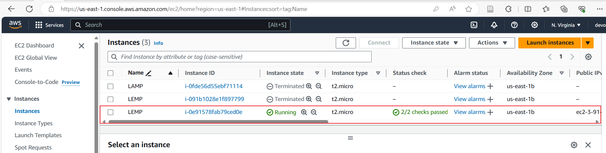

## Installing NGINX Webserver
Run a `sudo apt update` to download package information from all configured sources.

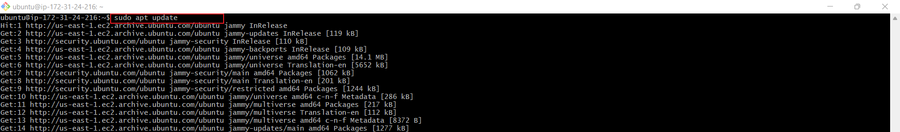

Then use the command `sudo apt install nginx -y` to install nginx

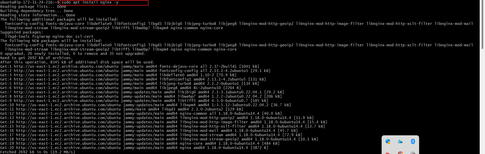

To verify that Nginx was successfully installed and running as a service in Ubuntu, run:

`sudo systemctl status nginx`

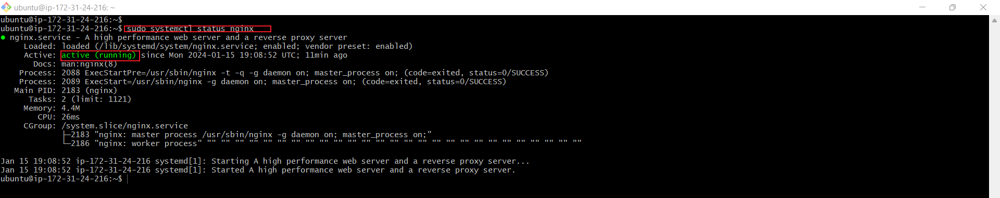

Before any traffic can be received by the webserver, we need to open a TCP port 80 which is default port that web browsers use to access web pages in the internet

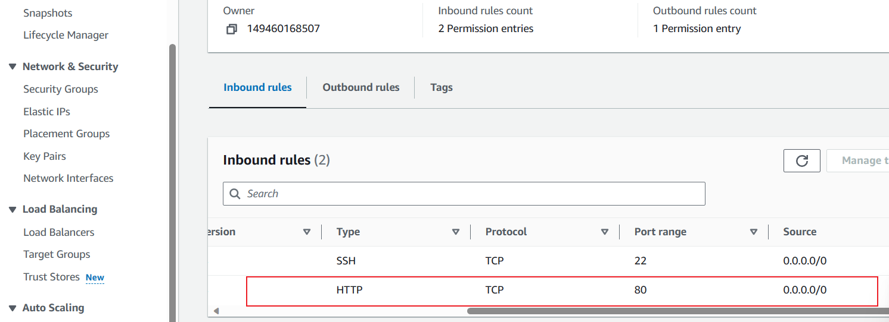

Open a web browser of your choice and try to access following url  
http://Public-IP-Address:80

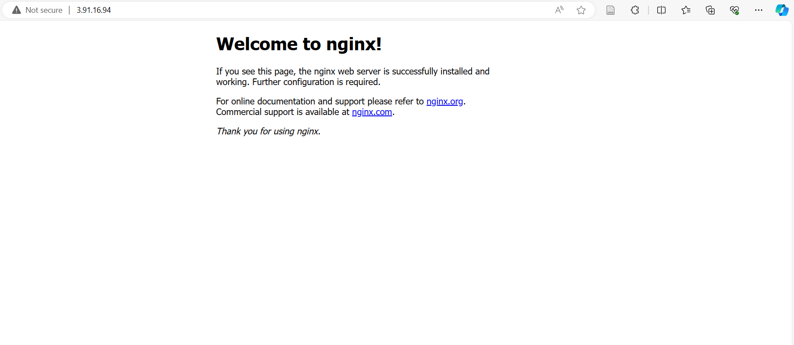

## Step 3 - Installing MySQL

A Database Management SDystem (DBMS) will be installed to store and manage data for your site in a relational database. MySQL is a popular relational database management system used within PHP environment.
Again, `apt` is used to acquire and install this software: 

`sudo apt install mysql-server -y`

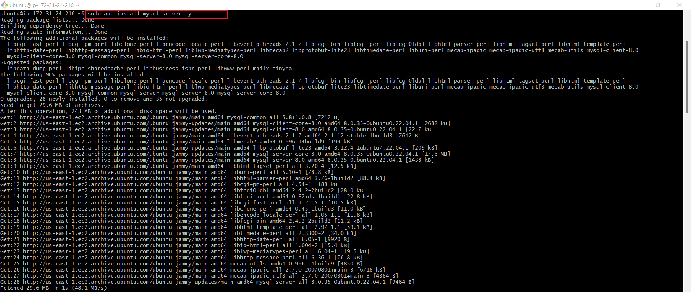

Provide added security to our mysql server by running `sudo apt install mysql-secure_installation`. This script will remove some insecure default settings and look down access to our database system.


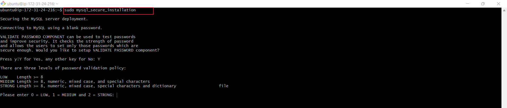 

MySQL sucessfully installed 

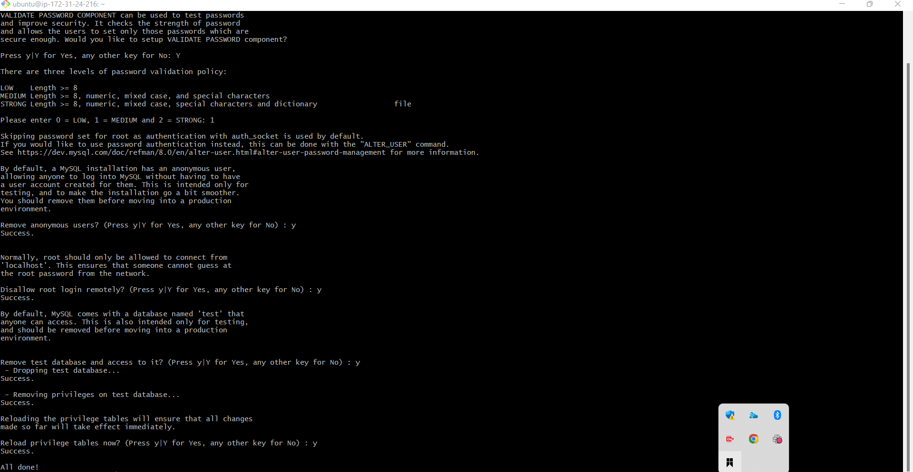

With mysql_server successfully configured, login into the mysql server.

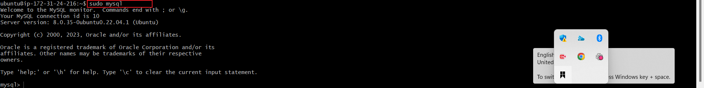

To exit from the webserver 

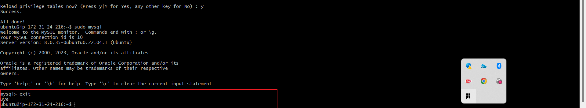 

## Step 4 - Installing PHP and its Modules

We use php to dynamically display contents of our webpage to users who make requests to the webserver.

You have Nginx installed to serve your content and MySQL installed to store and manage your data. We can then install PHP to process code and generate dynamic content for the webserver.

Run `sudo apt install php-fpm php-mysql`

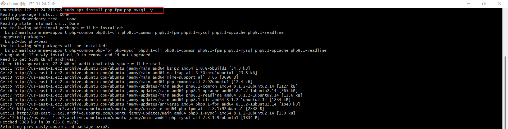

you now have PHP components installed. Next , you will configure Nginx to use them.

## Step 5 - Configuring Nginx to use PHP Processor

When using the Nginx web server, we can create server blocks (similar to virtual hosts in Apache) to encapsulate configuration details and host more than one domain on a single server.

Create the root web directory for your domain as follows:  
`sudo mkdir /var/www/projectLEMP`

Next, assign ownership of the directory with the $USER environment variable, which will reference your current system user:  
`sudo chown -R $USER:$USER /var/www/projectLEMP`

Create a new configuration file in Nginx’s sites-available directory  
`sudo nano /etc/nginx/sites-available/projectLEMP`


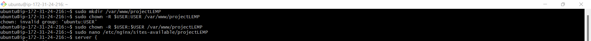

Paste in the following bare-bones configuration:

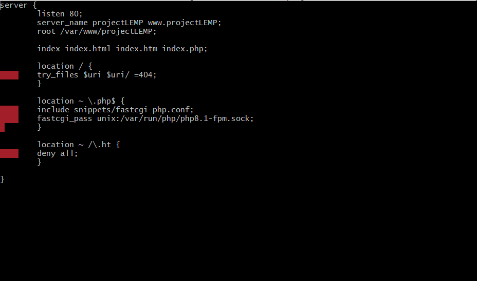

### ***Here’s what each of these directives and location blocks do:***
- listen — Defines what port Nginx will listen on. In this case, it will listen on port 80, the default port for HTTP.

- root — Defines the document root where the files served by this website are stored.

- index — Defines in which order Nginx will prioritize index files for this website. It is a common practice to list index.html files with a higher precedence than index.php files to allow for quickly setting up a maintenance landing page in PHP applications. You can adjust these settings to better suit your application needs.

- server_name — Defines which domain names and/or IP addresses this server block should respond for. Point this directive to your server’s domain name or public IP address.

- location / — The first location block includes a try_files directive, which checks for the existence of files or directories matching a URI request. If Nginx cannot find the appropriate resource, it will return a 404 error.

- location ~ \.php$ — This location block handles the actual PHP processing by pointing Nginx to the fastcgi-php.conf configuration file and the php7.4-fpm.sock file, which declares what socket is associated with php-fpm.

- location ~ /\.ht — The last location block deals with .htaccess files, which Nginx does not process. By adding the deny all directive, if any .htaccess files happen to find their way into the document root, they will not be served to visitors.

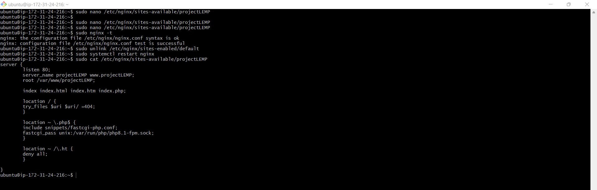

## STEP 6 – Testing PHP with Nginx

Your LEMP stack should now be completely set up.

You can test it to validate that Nginx can correctly hand .php files off to your PHP processor.  
You can do this by creating a test PHP file in your document root. Open a new file called info.php within your document root in your text editor:  
`sudo nano /var/www/projectlempstack/info.php`


Activate your configuration by linking to the config file from Nginx’s sites-enabled directory:  
`sudo ln -s /etc/nginx/sites-available/projectLEMP /etc/nginx/sites-enabled/`

Type or paste the following lines into the new file. This is valid PHP code that will return information about your server:

```php
<?php
phpinfo();
```


You can now access this page in your web browser by visiting the domain name or public IP address you’ve set up in your Nginx configuration file, followed by /info.php:  
http://PublicIPAddress/info.php  
You will see a web page containing detailed information about your server:


After checking the relevant information about your PHP server through that page, it’s best to remove the file you created as it contains sensitive information about your PHP environment and your Ubuntu server. You can use rm to remove that file:  
`sudo rm /var/www/your_domain/info.php`

You can now access this page in your web browser by visiting the domain name or public IP address you've set up in your Nginx configuration file, followed by /info.php:
http://PublicIPAddress/info.php

You will see a web page containing detailed informationabout your server.

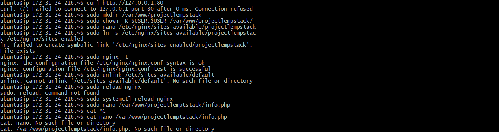

we can now access this page in the web browser by visiting the domain name or public IP address set up in the Nginx configuration file, followed by /info.php

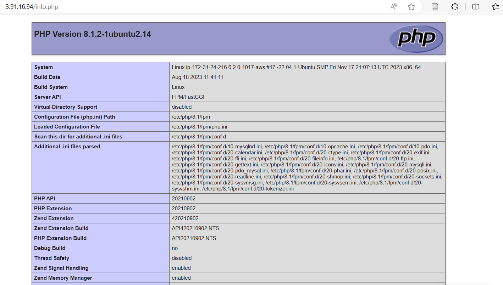

## Connecting PHP with MYSQL and fetching content 

In this step you will create a test database (DB) with simple "To do list" and configure access to it, so the Nginx website would be able to query data from the DB and display it.

First, connect to MySQL console using the root account:
`sudo mysql`

Create a new database `CREATE DATABASE <db_name>`

Create a new user and assign user a password `CREATE USER 'db_user'@'%' IDENTIFIED WITH mysql_native_password BY 'db_password'`

Grant the user permission over the created database `GRANT ALL ON 'db_name'.* TO 'db_user'@'%'exit` from the mysql-server in which we are currently logged in as root user and the login into mysql server using the created user.

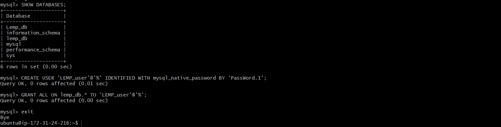

You can test if the new user has the proper permissions by logging into the MySQL console again, this time using the customer user credentials:
`mysql -u example_user -p`

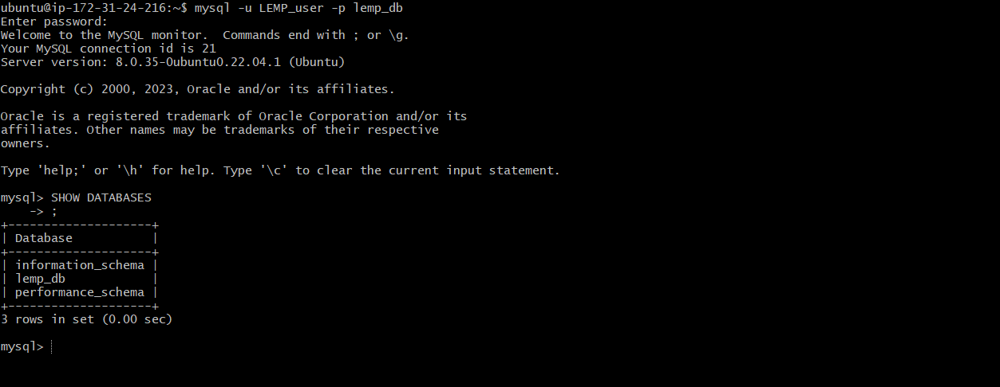

Next , we'll create a test table named todo_list From the MySQL console, run the following statement: 

 CREATE TABLE test_database.todo_list (item_id INT AUTO_INCREMENT,content VARCHAR(255),PRIMARY KEY(item_id));

 Insert a few rows of content in the test table. You might want to repeat the next command a few times, using different VALUES: 

 `mysql> INSERT INTO example_database.todo_list (content) VALUES ("My first important item");`

 To confirm that the data was successfully saved to your table, run: 

 `mysql> SELECT * FROM example_database.todo_list;`

 You'll see the following output:

 After confirming that you have valid data in your test table, you can exit the MySQL console:
 `mysql> exit`

 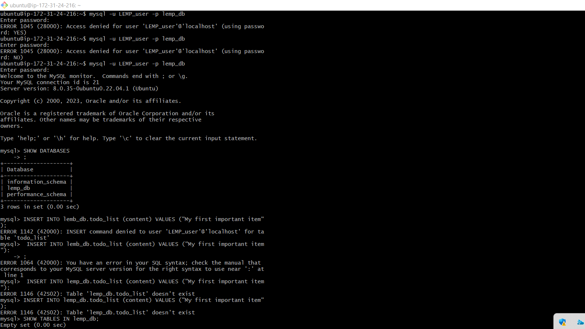

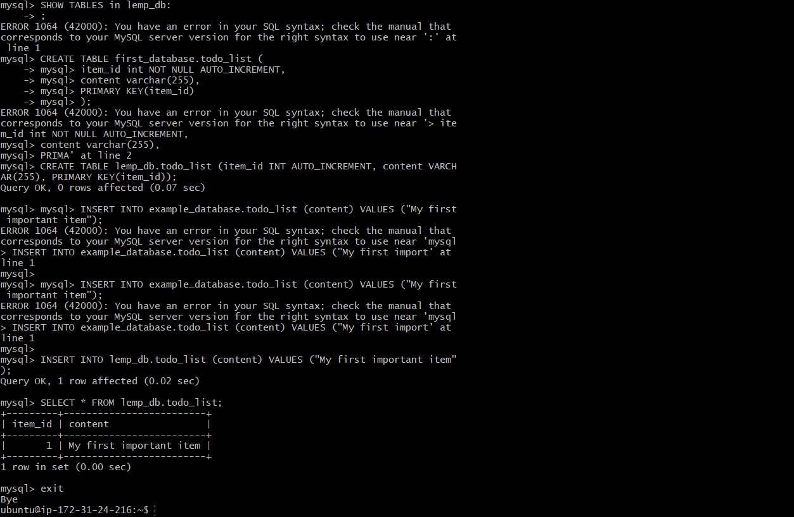


Now you can create PHP script that will connect to MySQL and query for your content. Create a new PHP file in your custom web root directory

`nano /var/www/projectLEMP/todo_list.php`


***The following PHP script connects to the MySQL database and queries for the content of the todo_list table, displays the results in a list. If there is a problem with the database connection, it will throw an exception.***

Copy this content into your todo_list.php script:

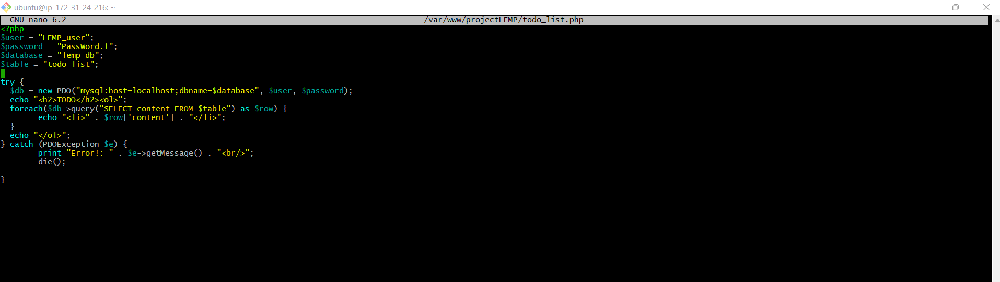

Save and close the file when done

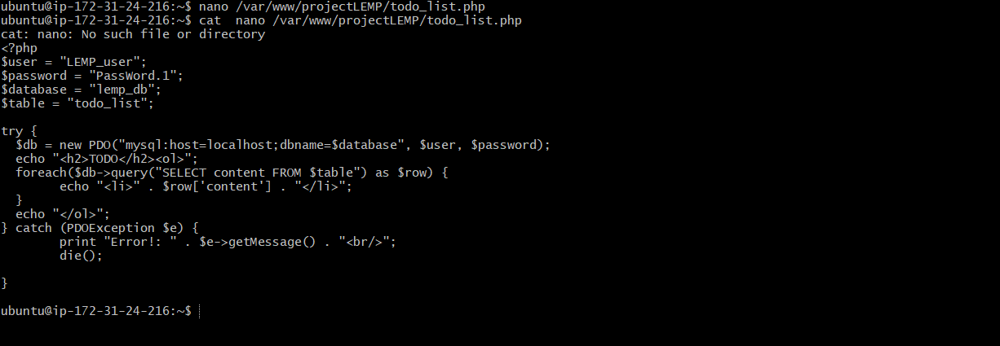

You can now access this page in your web browser by visiting the domain name or public IP address configured for your website, followed by /todo_list.php:

IP/todo_list.php

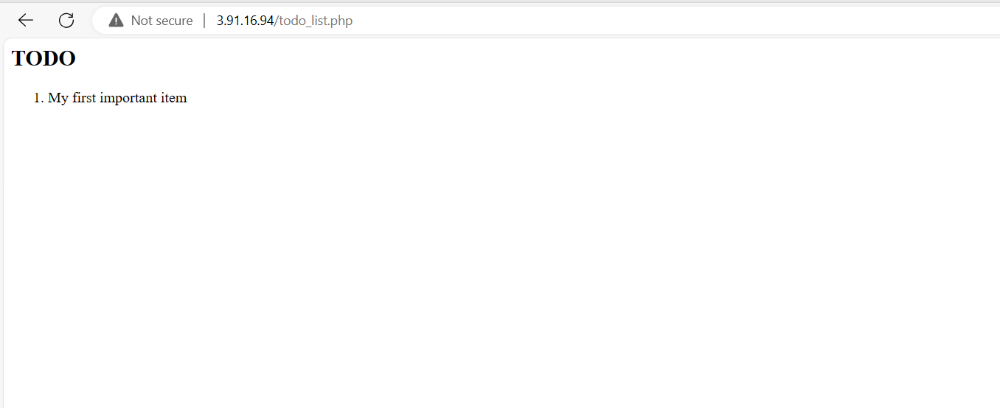

You should see a page like the above showing the content you’ve inserted in your test table:  
That means your PHP environment is ready to connect and interact with your MySQL server.